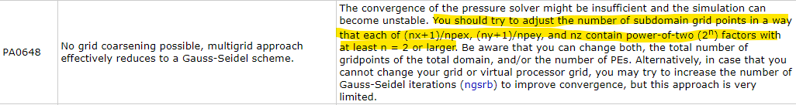

<header>
    <font size="+3"><b>palmpy Framework 1.0 Documentation</b></font>
</header>

**Table of Contents**

[TOC]

---

<div style="page-break-after: always; break-after: page;"></div>

# Introduction

Welcome to palmpy! This package will help you create static files for your PALM simulation. It contains various elements that deal with certain aspects of handling data for PALM, initially built around geodata products by swisstopo (*swissALTI3D, swissTLM3D*) and expanded since. Palmpy assists you in the following tasks:

- input data processing
  - raster data and shapefiles -> _static files
  - COSMO data preprocessor scripts to make them usable with INIFOR
- runtime analysis
  - plotting of *tmp/id.#/RUN_CONTROL* data (available soon)
- postprocessing of output data
  - regridding (available soon)


...with a clear focus on the first, as it is clearly the most labor-intensive and tedious step of them all. Part of the Framework are also supporting files, such as conda environment setup files and bash routines, that support PALM simulation activities in general.

This Framework is the result of student work at the Center for Aviation, ZHAW School of Engineering in Winterthur and is work in progress.

DISCLAIMER: No liability is assumed regarding the correctness of the provided routines. Users shall check the behavior and the produced results carefull. Reporting of bugs is highly appreciated.


## Applied Paradigms - how it works

Framework Components

- palmpy Python Package
- supporting Bash Scripts
- 


collection of functions

make static script to make static file

manual control with python programming language.


---

<div style="page-break-after: always; break-after: page;"></div>

<div style="page-break-after: always; break-after: page;"></div>

# Palmpy Description


## *geodatatools*


## *makestatictools*


## *mapdicts*


## Installation of palmpy

### Python Environment

In order for palmpy to operate, you need the following packages:


| Package Name | Version used in developing palmpy |
| -----------: | :-------------------------------: |
|        numpy |              1.18.1               |
|        scipy |               1.4.1               |
|   matplotlib |               3.1.3               |
|       pillow |               7.0.0               |
|      netcdf4 |               1.4.2               |
|         gdal |               3.0.2               |
|        pynco |               1.0.0               |
|     rasterio |               1.1.0               |
|     (pandas) |               1.0.3               |
|  (geopandas) |               0.6.1               |


It is strongly recommended to set up python with the conda package management ecosystem. There are many ways to do it. Users relatively unfamiliar with python can install the full [Anaconda](https://www.anaconda.com/) software, which comes with the most relevant python packages for doing science, but also with some baggage in form of software. More experienced users, who know what packages they need and are able to install them easily, can install python with a [Miniconda](https://docs.conda.io/en/latest/miniconda.html) installer, which only installs the bare minimum of packages and python on the machine (much smaller download size). Most importantly, the conda package manager is installed as well. 

Once a running conda environment (usually named ``base``, you can check it with entering ``conda env list`` into the Anaconda Prompt (in Windows) or your regular shell (in Linux)) is present. we set up a new environment that contains all necessary packages to run palmpy. Environment are an essential tool when it comes to software development and allows to "freeze" an environment to have defined package versions and dependencies for a particular project. After the following process, an environment "palm" (or however you name it) shall be present in the conda environment list.


<center><font size="-1">Different conda environments on a computer.</font></center>


Depending on your system, choose the appropriate .yml file from the ``env`` folder. Try to use the one with package version info first. This may not work on systems other than Windows 10 x86.

```bash
  conda env create -f palmenv-versinfo.yml -n <envname>
```

The string after ``-f`` represents the path to the .yml file, the string after ``-n`` the name of the environment that you create. If it does not work because some packages are not found, use the .yml file without version numbers attached to the packages. If there are errors relating to "invalid name" or similar, check your path to the .yml file.


#### A Word on Environments and Packages

This concept of having various environments with the same packages over and over again may be confusing to new python users at first. However, it makes perfect sense to have controlled package versions for a project. As python modules are updated, some functions may stop working, and new functions may be added that make life much easier. Having a python environment for everyone working on a project ensures that everyone is able to execute this particular code and it can be shared among coworkers. Therefore, and because palmpy is the result of a student project, continuous maintenance will not be available. Should therefore e.g. numpy be updated and a specific function be made obsolete, on which palmpy relied on heavily, the code will simply stop working. Therefore, installing a python environment from a yml file ensures that the environment is set up correctly with correct version numbers. However, this process can be prone to errors, especially when installing an environment on different operating systems. Therefore, a .yml file without version names is included, that should work on any given operating system. 

For this project, Spyder was used to write palmpy. Spyder is a package like any other and can be installed with conda. When installing multiple environments and you intend to use spyder for every one of them, it seems that you have to include the spyder package in these environments as well. In the end, when you start up spyder to work on a particular project, make sure to open the correct one - you can recognize that on the Shortcut name "Spyder (palm)" or "Spyder" (no env name for the base environment) or "Spyder (randomproject)".


### Package Installation

When importing a package in python with ``import package``, python automatically scans its $PATH variable for the required package. Therefore, if we want palmpy to be fount, we need to move the palmpy folder into one of those locations. In order to know, where you should put it, open a python console in your newly created environment (eg. open ``Spyder (envname)`` to open Spyder with your desired environment or open Anaconda promt, run ``conda activate envname``, followed by ``python`` to enter the python interpreter).  Run the following:

```python
import sys
print(sys.path)
```

This will output a list of paths, that are searched for the module. Your best bet is to put the palmpy module folder into your ``...\\Miniconda3\\envs\envname\\lib`` folder.

If you are able to import the module palmpy with ``import palmpy`` and no error appears, the package was installed correctly.


### Basic Usage

It is recommended to load the different modules of the palmpy package as follows:

```python
#static file generation
import palmpy.staticcreation.geodatatools as gdt      # geodata modification tools
import palmpy.staticcreation.makestatictools as mst   # static generation tools
import palmpy.staticcreation.mapdicts as mpd		  # mapping dictionaries for mst

#post processing
import palmpy.postprocessing.tools as ppt             # postprocessing tools
```


To create a static file, you need the palmpy *geodatatools*, *makestatictools* and the dictionaries for mapping shp-file classes to PALM classes - which are separately available in *mapdicts*. Should a default mapping be not suitable for a particular project, this *mapdict*s file can be modified accordingly. For individual application of palmpy, these dicts can be accessed through python individually.


---

<div style="page-break-after: always; break-after: page;"></div>

# Create a PALM Static driver using palmpy

### QGIS Input File Preparation


#### Paradigms and Standards


#### Rastered Data

geotiff

##### Topography


##### Surface Classification


#### Shapefiles

insert Table here


##### Resolved Vegetation


##### Pavement / Sealed Surfaces


##### Crops

| OBJEKTART | Crop Type                            |
| --------- | ------------------------------------ |
| 1000      | Bare Field                           |
| 1001      | Grass Field                          |
| 1002      | Low Crops (Such as beet, Potatoes, ) |
| 1003      | Wheat                                |
| 1004      | Corn                                 |


##### Buildings


### Static File Generation Script


#### Script

How the Script works


#### Namelist

The namelist is used to provide all necessary information to create the static driver file. The namelist is split into different sections, which provide some kind of organization to the namelist file. The namlist is a file that ends in ``.ini``, a common ending for configuration files in Windows and other applications. Below, each section and its parameters are described. 

*Note: **All parameters need to be provided** in a config file. However, if some parameter is not needed, the part after the equal sign can be left blank. Furthermore, all values are interpreted by the script as strings. So if a string is to be provided, no "" need to be set. If an int or float are required, just provide the number (i.e. 1 or 1.0).*


``[settings]``

This section contains top level information about the simulation.

| Parameter       | dtype                   | Description                                                  |
| --------------- | ----------------------- | ------------------------------------------------------------ |
| *casename*      | string                  | Name of the case. Used to construct the file names for the script output. |
| *origin_time*   | YYYY-MM-DD HH:mm:SS +TZ | Origin time of the PALM simulation. This is a critical parameter and needs to be set correctly, otherwise the sun position and COSMO forcing may be incorrect. |
| *totaldomains*  | int                     | Number of Domains that are to be set.                        |
| *cutorthoimg*   | boolean                 | ``True`` if for each domain an orthoimage shall be cut to the correct extents. Can be used in VAPOR visualizations. ``False`` if not needed. |
| *extentsonly*   | boolean                 | If ``True``, only the config file is read, checks are done and the extents are plotted in a graph. This can be used to fine-tune the choice of extents and probe locations. |
| *orthores*      | int                     | Resolution of the image on which the extents are to be plotted. For larger domains this resultion can be increased (5m or higher), for small ones choose a smaller resolution (2 m). Lower resultions result in larger file sizes. |
| *rotationangle* | float                   | Angle by which the domain is rotated. Useful in runs with noncyclic BC as specific wind-tunnel like setups. Not really supported at the moment by PALM. |
| *set_vmag*      | float                   | Estimated velocities that are set by you or INIFOR. Used to calculate a runtime score, that gives a hint about the cases complexity and therefore its runtime. |
| *simtime*       | float                   | Used to construct the inifor namelist, that is also output when running the make_static.py script. |


``[paths]``

In this section all paths need to be specified to the required files. The path separator that is used here is ``\`` in windows and ``/`` for linux paths. Preferrably use absolute paths.

| Parameter        | Description                                                  |
| ---------------- | ------------------------------------------------------------ |
| *modulepath*     | Path to the palmpy folder. Needs a trailing separator.<br />Example: ``modulepath = C:\Users\Username\Documents`` |
| *inputfilepath*  | Path where all the input files are stored. Needs a trailing separator. |
| *outpath*        | Path where the output files shall be saved. Needs a trailing separator.<br />Example: ``tmp = C:\Users\Username\Desktop\case\`` |
| *tmp*            | Path where temporary raster files shall be saved (usually to a tmp folder within the outpath). Needs a trailing separator.<br />Example: ``tmp = C:\Users\Username\Desktop\case\tmp\`` |
| *orthoimage*     | Filename of the Orthoimage. Needed if ``cutorthoimg`` is set to true and extents shall be plotted. |
| *dhm*            | Filename of the digital height model (without buildings) raster file (geotiff). Used to create the terrain for the PALM simulation. |
| *bb*             | Filename of the shapefile with land cover information. This information will be resolved in parametrized in 2D. Used to construct the ``vegetation_type`` variable. |
| *resolvedforest* | Filename of the shapefile with forest polygons that shall be resolved in 3D (e.g. extract from land cover file). If 3D vegetation shall be resolved, one of ``resolvedforest, treerows`` or ``singletrees`` shall be provided. Used to construct the ``LAD`` variable. |
| *treerows*       | Filename of the shapefile with tree line polygons that shall be resolved in 3D (e.g. puffered from shapefile with line features). If 3D vegetation shall be resolved, one of ``resolvedforest, treerows`` or ``singletrees`` shall be provided. Used to construct the ``LAD`` variable. |
| *singletrees*    | Filename of the shapefile with single tree polygons that shall be resolved in 3D (e.g. puffered from shapefile with point features). If 3D vegetation shall be resolved, one of ``resolvedforest, treerows`` or ``singletrees`` shall be provided. Used to construct the ``LAD`` variable. |
| *pavementareas*  | Filename of the shapefile with information about paved areas, such as streets, parking lots, town squares, everything that is not vegetation and is an artificially sealed surface (e.g. merged shapefiles with street, railways, airport movement areas, parking lots etc.). Will be used for ``pavement_type`` variable. |
| *gebaeudefoots*  | Filename of the shapefile with information about building footprints. Used to create buildings in 2D and 3D (to benefit from the latter, ``HEIGHT_BOT`` needs to be provided as an attribute). |
| *crops*          | Filename of the shapefile with information about crop fields. Crop field information may not be present in land cover data as it changes often. |
| *streetsonly*    | Filename of a shapefile with street information only (needs to be provided for creating the ``street_type`` variable for emission representation). |


``[probes]``

It is possible to specify probe locations in the namelist. The script will plot their positions on the overview plot and plot probe coordinates respective to each chosen domain.

| Variable | dtype             | Description                                                  |
| -------- | ----------------- | ------------------------------------------------------------ |
| probes_E | float, float, ... | List of Easting Coordinates of a probe, separated by a comma. The first entry corresponds the first probe, and so forth. |
| probes_N | float, float ...  | List of Northing Coordinates of a probe, separated by a comma. The first entry corresponds the first probe, and so forth. |


``[change_npars]``

In order to change vegetation, pavement, water, soil or albedo parameters individually, set the flags ``dovegpars`` or ``doalbpars`` to ``True`` for each domain. If a flag is set to ``True``, values must be provided or an error is raised (``string index out of range``). In the following,  ``filterarr`` refers to an array which is searched for the ``filtervalue`` - where the search matches, the ``newvalue`` is put into the ``x_pars`` array on the ``npar``'th level (see PALM documentation, PIDS Tables). The four values to be provided can be remembered as: "Set the parameter ``npar`` to ``newvalue`` where the pixel in ``filterarr`` equals ``filtervalue``".

| Parameter          | Description                                                  |
| ------------------ | ------------------------------------------------------------ |
| *vegparchanges*    | Provide in form ``npar:newvalue:filterarr:filtervalue``, where filterarr  = 0 means from source array, filterarr = 1 corresponds to array after mapping (palm classes). For crop types (>= 1000) only 0 is supported. Multiple requested changes are to be separated by commas. <br /><br />Example: ``vegparchanges = 4:0.5:0:1004, 4:0.2:0:1003`` |
| *watparchanges*    | Provide in form ``npar:newvalue:filterarr:filtervalue``, where filterarr  = 0 means from source array, filterarr = 1 corresponds to array after mapping (palm classes). Multiple requested changes are to be separated by commas. |
| *pavparchanges*    | Provide in form ``npar:newvalue:filterarr:filtervalue``, where filterarr  = 0 means from source array, filterarr = 1 corresponds to array after mapping (palm classes). Multiple requested changes are to be separated by commas. |
| *soilparchanges*   | Provide in form ``npar:newvalue:filterarr:filtervalue``, where filterarr  = 0 means from source array, filterarr = 1 corresponds to array after mapping (palm classes). Multiple requested changes are to be separated by commas. |
| *albedoparchanges* | Provide in form ``npar:newvalue:filterarr:filtervalue``, where filterarr  = 0 means from source array, filterarr = 1 corresponds to array after mapping (palm classes). Multiple requested changes are to be separated by commas. |
| *bldgparchanges*   | Provide in form ``npar:newvalue:filterarr:filtervalue``. Filterarr here corresponds to the following attributes: <br />- 0: ``building_type``<br />- 1, 2, 3 : ``GROUPING1``, ``GROUPING2``, ``GROUPING3``<br />... of the building footprints shapefile. This way, either all elements of a certain building type can be changed, or logical groupings can be defined on three levels (e.g. by zip code, by color, by group to be changed or whatever). More levels can be added easily to the script. |


``[domain_N]``

For each domain, the following parameters shall be given. 

| Parameter         | dtype   | Description                                                  |
| ----------------- | ------- | ------------------------------------------------------------ |
| *ischild*         | int     | Domain Number. Parent is 0, every child domain has a value above 0. |
| *xlen*            | int     | X extent of the domain (eastwards) in meter.                 |
| *ylen*            | int     | Y extent of the domain (northwards) in meter.                |
| *xmin*            | float   | X (Easting) coordinate position of the lower left domain corner. |
| *ymin*            | float   | Y (Northing) coordinate position of the lower left domain corner. |
| *zmax*            | float   | Domain vertical extent in meters.                            |
| *xres*            | float   | Domain resolution in X direction.                            |
| *yres*            | float   | Domain resolution in Y direction.                            |
| *zres*            | float   | Domain resolution in Z direction.                            |
| *doterrain*       | boolean | D                                                            |
| *dotlmbb*         | boolean | Create vegetation_type variable for this domain.             |
| *dopavedbb*       | boolean | Create pavement_type variable for this domain.               |
| *docropfields*    | boolean | Incorporate additional crop field information (set vegetation_type = 2) based on an additional shapefile. |
| *dolad*           | boolean | Create 3D resolved vegetation for this domain.               |
| *dobuildings2d*   | boolean | Create 2D buildings with height information for this domain. |
| *dobuildings3d*   | boolean | Create 3D buildings (each grid point = 1 or 0) for this domain. |
| *dovegpars*       | boolean | Change individual vegetation parameters based on provided ``vegparchanges`` information for this domain. It is good practice to set this parameter the same for all domains. |
| *doalbedopars*    | boolean | Change individual albedo parameters based on provided ``albedoparchanges`` information for this domain. It is good practice to set this parameter the same for all domains. |
| *dostreettypes*   | boolean | Create a ``street_type`` variable for this domain.           |
| *bulkvegclass*    | boolean | Assign this value / PALM vegetation class to pixels in ``vegetation_type`` that have not been covered by the input shapefiles. Usually 3 for grass or 1 for bare soil. |
| *pave_alltouched* | boolean | Method selector during shapefile polygon rasterization with GDAL. Activates the GDAL option "ALL_TOUCHED" . This means that the shapefile value is burnt into every pixel the polygon touches, instead of burning in the value only if the centroid of the pixel is within the polygon.   If the domain resolution is chosen too coarse, streets may not be rasterized continuously anymore and potential emission locations become unrealistic. With ``pave_alltouched = True``, streets may become too wide, however they are still continuous. |
| *bulkpavclass*    | boolean | Assign this value / PALM pavement class to pixels in ``pavement_type`` that have not been covered by the input shapefiles. Usually 1 for asphalt/concrete mix. |
| *lai_forest*      | float   | Leaf Area Index for forest polygons. Parameter to construct a Leaf Area Density vertical profile. |
| *lai_breihe*      | float   | Leaf Area Index for tree line polygons. Parameter to construct a Leaf Area Density vertical profile. |
| *lai_ebgebu*      | float   | Leaf Area Index for single tree polygons. Parameter to construct a Leaf Area Density vertical profile. |
| *a_forest*        | float   | alpha Shape parameter for beta-distribution for forest polygons. Parameter to construct a Leaf Area Density vertical profile. |
| *b_forest*        | float   | beta shape parameter for beta-distribution for forest polygons. Parameter to construct a Leaf Area Density vertical profile.                                                          |
| *a_breihe*        | float   | alpha shape parameter for beta-distribution for tree line polygons. Parameter to construct a Leaf Area Density vertical profile.                                                           |
| *b_breihe*        | float   | beta shape parameter for beta-distribution for tree line polygons. Parameter to construct a Leaf Area Density vertical profile.                                                          |
| *a_ebgebu*        | float   | alpha shape parameter for beta-distribution for single tree polygons. Parameter to construct a Leaf Area Density vertical profile.                                                        |
| *b_ebgebu*        | float   | beta shape parameter for beta-distribution for single tree polygons. Parameter to construct a Leaf Area Density vertical profile.                                                     |


#### Hints Regarding Domain Creation

##### Grid Dimensions

Choosing valid domain extents can be tricky. There are a few rules that need to be followed, which are explained next. 

**Limitations  on nx and ny**

When choosing the extents of the domains, keep in mind that the resulting number of gridpoints in x and y direction (``nx`` and ``ny``) must match the processor grid that results due to your choice of number of cores. What does that mean? When assigning 24 processor entities (cores, PE) to a domain, the domain will be split into 24 subdomains, one for each processor. With 24 cores, the resulting processor grid will be a 6 by 4 grid (whose dimensions are called ``npex`` and ``npey``). Therefore, your ``nx`` and ``ny`` respectively must be integer divisible by  ``npex`` and ``npey``.  Furthermore, which is a bit more tricky is the fact that ``(nxy+1)/npexy`` must hold with the result containing a factor 2<sup>n </sup> with n >= 2. Choose basic domain extents, check the distribution of cells with the chosen resolution. Optimize the core count per domain based on their factorization (``npex and npey``).  




<center><font size="-1">With wrong nx and ny values, the multigrid solver cannot work correctly and may become unstable.</font></center>


There is a python script ``palm_gf`` that should simplify the grid finding process. What will mostly work best is a processor grid that has 2<sup>n</sup> values in x and y direction (32 cores = 4x8, 64 cores = 8x8, 16 cores = 4x4, 8 cores = 2x4, ...). So use nx and ny that are powers of two and also core numbers that are powers of two. 

To get maximum usage out of speedflyer, use for example the following number of cores (not exhaustive):

| # Domains | Domain 1 | Domain 2 | Domain 3 | Domain 4 | Domain 5 |
| :-------: | :------: | :------: | :------: | :------: | :------: |
|     1     |    64    |          |          |          |          |
|     2     |    64    |    32    |          |          |          |
|     3     |    32    |    32    |    32    |          |          |
|     4     |    32    |    32    |    16    |    16    |          |
|     5     |    32    |    32    |    16    |    8     |    8     |


---

<div style="page-break-after: always; break-after: page;"></div>

# Further Information

## Dynamic Driver Generation with INIFOR

PALM can be forced with COSMO-Data. PALM is shipped with a routine called INIFOR, which interpolates boundary conditions from hourly COSMO-DE data for the lateral and top boundary, furthermore, it creates an initial condition volume field for the domain. Also, geostrophic wind components are extracted from the COSMO pressure field, as well as a surface pressure value. 

With its orientation towards data available in Germany, INIFOR is intended to be used with COSMO-DE data, which is available in 2 km resolution and with a specific naming of the variables. Swiss COSMO-Data, which was made available so far with the ZHAW, is in a different format and in 1 km resolution. Apart from this, the variable naming does not seem to be consistent anyway, which requires some modifications to the COSMO-Files before being able to use them in INIFOR. To convert them into INIFOR-readable format, two scripts for two different conventions have been written (routines cosmo2inifor). Their operation is detailed below. After conversion, INIFOR can be run, this process is also outlined below.


### cosmo2inifor

cosmo2inifor is a bash script, that converts COSMO-1 Data to INIFOR-appropriate format. Two revisions exist, which support two different variable conventions:

| Name              | Use with                                                     |
| ----------------- | ------------------------------------------------------------ |
| cosmo2inifor_revC | lafYYYYMMDDHH.nc files from ETH Server                       |
| cosmo2inifor_revD | meteotest_....nc file (multiple files per hour), received for project at the ZHAW |

Should you encounter a COSMO-Output format that cannot be processed with one of the above routines, a specifically tailored one needs to be set up or can be derived from the above routines.

These routines make use of 

- nco (4.8.1): ncks, ncrename, ncatted, ncap2
- netcdf (4.6.1): ncdump


**Using cosmo2inifor**

1. On the ZAV cluster (Twins), these modules can be loaded with the command ``module load nco/4.8.1 netcdf/4.6.1-gnu``. 

2. Put the files, that are to be converted, into a directory with the cosmo2inifor routine. If you simulate a time span of 1200Z-1600Z, you need the files with results of the hours 12, 13, 14, 15 *and* 16.
3. Run the script with ``./cosmo2inifor_revX``. It will extract a ``hhl.nc``, ``soil.nc`` and for each hour a ``segYYYYMMDDHH-flow.nc`` and ``segYYYYMMDDHH-soil.nc`` file.


*Special Case _revD*: As this routine is designed to work with a specific meteotest format that the ZHAW received on a one-time-only basis, there are some more restrictions on its use. For instance, HHL and Soiltype information is available in a separate file instead of it being included in 00Z files. Put the Files containing HHL and soiltype (``meteotest_..._hhl/soiltyp_...00.nc``) into a subdirectory called ``hhlsoil``. The filenames are hardcoded at the moment, so change them in the cosmo2inifor_revC file (``hhlfile`` and ``soilfile``).


### INIFOR

INIFOR will interpolate (bilinear, as of April 2020) boundary conditions from the COSMO data. It requires a soil.nc, hhl.nc and for each hour a -flow.nc and a -soil.nc file, which need to be available in a single location. It also requires a namelist containing information of the parent domain (the one that will be forced). It can look like the following:

```fortran
&inipar nx = 127, ny = 127, nz = 96,
        dx = 32.0, dy = 32.0, dz = 32.0,
    /
&d3par    end_time = 86400.0
    /
```

Under ``&inipar``, grid information of the parent is given. Under ``&d3par`` the endtime is given. This namelist file is automatically generated when running make_static.py, taking all necessary information from the corresponding namelist for the make_static routine. Coordinates are taken from the static-driver, so it has to be ensured that this information is correct. Furthermore, even though the static-file origin_time attribute is unused for now, it will be used in the future, so it should be correctly set as well. It has the format ``YYYY-MM-DD HH:MM:SS +ZZ``. 

Load required modules to run PALM before running INIFOR. INIFOR is executed as follows in the bash shell:

```bash
inifor -p <path> -d <YYYYMMDDHH (in UTC)> -i <init-mode> -n <namelist> --input-prefix <input-prefix> -t <static-driver> -o <output> -a <averaging-angle>
```


**Hints / Troubleshooting:**

- Date format: YYYYMMDDHH. Start time stamp is used, it know how far to process from the end_time parameter in the namelist.
- input-prefix is ``seg``, if the files were processed with cosmo2inifor. Standard is ``laf``.
- Averaging angle ``-a`` might not work if the is below 0.2. So far, no real changes were visible when going from an averaging angle of 0.1 to 0.01.

- If a segmentation-fault occurs during processing, create a copy of the .palm.config.twins18 and recompile it with ``palmbuild -c twins18(copy)``. This seems to recompile INIFOR too. Usually it works again after that. Negative averaging angles also lead to a segmentation fault.


## VAPOR Visualization

VAPOR is a visualization tool for scientific 3D data. From VAPOR 3 and above, netCDF files can be imported easily, if they conform to the CF-1.7 standard. This requires to have an "axis"-attribute for each coordinate variable (e.g.``axis:X``for the ``x`` variable, and so forth for ``xu, y, yv, zu_3d, zw_3d, zs_3d``). This was missing until recently in PALM, this axis is now automatically added (from March 2020 onwards). Before, it could be added with ``ncatted -O -a axis,x,o,c,"X" <file>`` for example.

In order to have terrain in the 3D, file this information needs to be copied from the static driver to the 3D-File. This can be achieved with the following command:

```
ncks -A -v <static-file> <3d_output_file>
```

Bear in mind, that this is currently only easily doable for netcdf-3 output on the PALM side (netcdf_output_format == 3). 

VAPOR works on the basis of vdc files. NetCDF files can be converted into vdc files with a series of VAPOR command line tools - however, I have not managed to complete the whole process. It should be doable with the commands (in this order) ``cfvdccreate <outputfile> <file.vdc>``, which creates a header file. Then, ``cf2vdc outputfile file.vdc`` should populate the file with data from the nc-file. 


## PALM Simulation Lessons Learned

The following questions are written down here for a reason. They are important questions to ask yourself when simulating with PALM.


- Are the static driver **time stamps, end_times and skip_time_data_output** parameters in the namelists correct?
- Are you simulating the **correct day**?
- Have you supplied ``-a "d3#/r restart"`` when you want to continue your run after? If not, its all lost.
- Have you checked that **output variables** are really only **supplied once**, especially the _av ones? (These arrays are set up after skip_time_data_output, if you skip large parts of your simulations, an error is raised and the simulation is lost)
- A simulation can be started with ``palmrun ...... -v > logfile &``. With this, the output is piped into a logfile and with ``&`` the command is executed in a subshell. This means, that one can log out of the cluster without the palmrun routine being aborted. This could also be achieved with ``nohup palmrun .... -v &`` , which apparently also pipes the output to a ``nohup.out`` file (not tested).
- When monitoring the simulation progress over a VPN connection with ``tail -f <logfile>``, it might occur that the simulation aborts with the message ``-> palmrun finished`` if the VPN session is aborted due to the computer entering energy saver mode or something else. It has proven more robust by monitoring the percentage of the simulation progress with spot checks, and await the completion of the job by monitoring the Ganglia load monitor.


---

<div style="page-break-after: always; break-after: page;"></div>


# Useful Code Snippets

## Castor / Pollux Cluster

load required modules to run PALM (**basic configuration**, without parallel I/O, no RRTMG!)

```bash
module load gnu mpich2/3.3.1-gnu hdf5/1.8.15-gnu7 netcdf/4.6.1-gnu7 netcdf/4.4.4-gfort7
```

use RRTMG as well (if compiled): run the following command before starting a simulation:

```bash
export LD_LIBRARY_PATH=/cluster/home/<rrtmg_install_location>/lib/rrtmg/shared/lib:$LD_LIBRARY_PATH
```


To choose **how many cores** the run should use can be steered with the hostfile supplied in the ``.palm.config.<identifier>`` file under ``%execute_command``. There, a path to a hostfile is given, where for every node it's IP address is given and how many cores are available. This hostfile must look like the following:

```bash
# The following node is a dual processor machine:
192.168.111.250:50

# The following node is a dual-processor machine:
192.168.111.251:50
```

The config does not have to be recompiled. The flag ``-T`` does not have an effect on the Speedflyer cluster.


## NCO

```bash
# overwrite attribute grid_mapping in variable SOILTYP (if global, write global) by a c(haracter) entry
ncatted -O -a grid_mapping,SOILTYP,o,c,'rotated_pole' soil.nc

#cut a file according to those dimensions given
ncea -d y_1,-0.5,0.5 -d x_1,-1.0,0.0 filein fileout

# add a value to a variable. -O is overwrite, -s is for an arithmetic expression.
ncap2 -O -s ‘time=time+39600’ <in> <out>

# copy variables from one into another file
ncks -A -v <var> <static-file> <3d_output_file>

# add an attribute to a variable
ncatted -O -a <attname>,<var>,<mode mostly o>,<dtype (c for char)>,"<attribute>" <file>

# concatenate output files to one large file (only works without errors if equal variables are present)
ncrcat -v var1,var2,var3 inputfiles outputfiles
# as an example with multiple input files and all variables:
ncrcat yv-jor-2_av_3d_N02.00{0..5}.nc yv-jor-2_av_3d_N02.nc
```


## CDO

**Regridding**

Make a gridfile (target.grid) of the form:

```
gridtype   =     lonlat
xsize      =     500
ysize      =     200
xfirst     =     5.7
xinc       =     0.01
yfirst     =     45.70
yinc       =     0.01
```

and run ``cdo remapbil,target.grid input output``.

Industry Standard seems to be ``remapcon`` (conservative), ``remapbil`` is bilinear remapping.


## GIS / GDAL

**Fill empty values in a raster with values from another raster**

Example: swissAlti3d data close to the swiss borders contains only empty values outside of swiss territory. Idea: fill those areas with data from coarser NASA SRTM data. Problem: inhomogeneous resolutions and CRS (swissAlti3D is LV95 and 2x2m, NASA SRTM is WGS84 and 30x20m around Switzerland).

How to:

- reproject NASA SRTM Dataset to LV95 (QGIS: Raster -> Projections -> Transform)
- cut NASA SRTM Dataset to a bit larger than the swissAlti3D subset (QGIS: Raster -> Extract -> Cut Raster to Extents)
- resample NASA SRTM Dataset to swissALTI3D-Resolution (QGIS: right click on layer -> Save as -> set Resolution in the correct boxes)
- With installed QGIS: Open *osgeo4w shell*. Without: Install GDAL Command Line Tools under Windows, or do it in Linux
- ``gdal_merge -o <outfilename> <infile> <infile2>`` does the job. Here, the input files are being put on top of each other, later mentioned files are put on top of earlier ones. Resolution information comes from the first one. Output datatype is guessed from the file ending of the outfilename (.tif is your best bet). 

For every QGIS operation there is a gdal equivalent, multiple steps can be done with e.g. gdal_translate. The command line is mighty: why point at things in a GUI while you could simply say what you want to do.


---

<div style="page-break-after: always; break-after: page;"></div>

# Glossary


