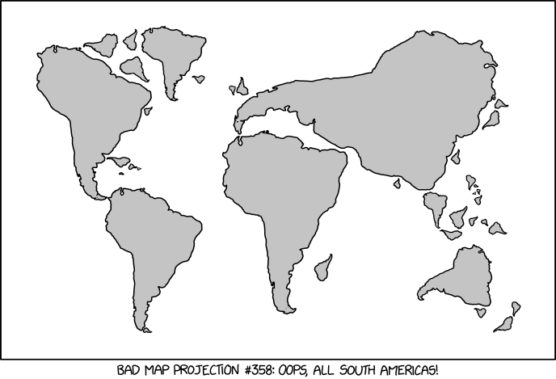
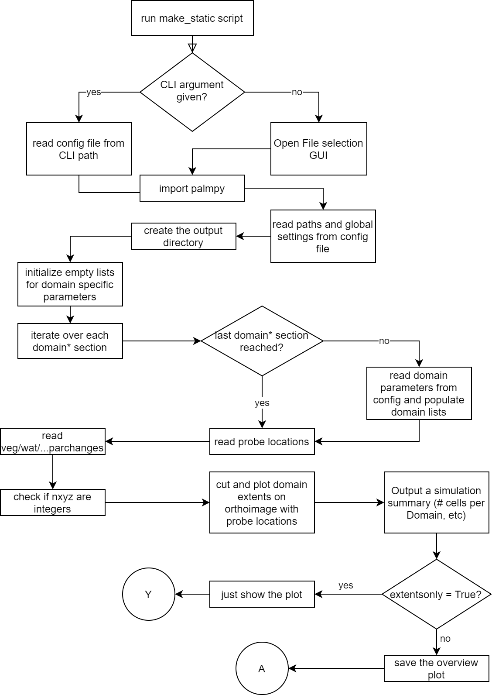
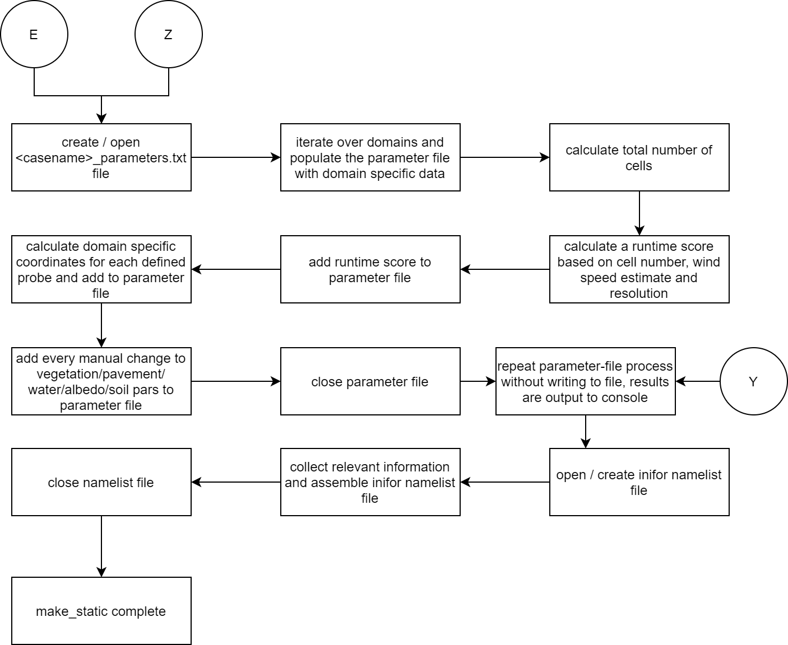

<center><font size="+1"><b>palmpy Framework V1.0 Documentation</b></font></center>


<center><b><font size="+0">Author</b></font></center>

<center><font size="+0">Stefan Fluck</font></center>

<center><font size="+0">fluckste@students.zhaw.ch or fluf@zhaw.ch</font></center>


<center><font size="-1">Part of a Master Thesis</font></center>


**Quick Links:**

 *[Geodata Reference Table](#Geodata Shopping List)*

*[INIFOR](#INIFOR)*


<div style="page-break-after: always; break-after: page;"></div>

**Table of Contents**

[TOC]


---


<div style="page-break-after: always; break-after: page;"></div>

# Introduction

Welcome to palmpy! This useful collection of code will help you create static files for your PALM simulation. The code collection and this documentation assists you in the following tasks:

- PALM static driver file generation
  - transform raster data and shapefiles into PALM-readable format
- PALM dynamic driver file generation
  - COSMO data preprocessor scripts to make them usable with INIFOR
- Runtime progress plot
  - plotting routine for *tmp/casename.id/RUN_CONTROL* data

...with a clear focus on the first task, as it is clearly the most labor-intensive and tedious step of them all. Part of the framework are also supporting files, such as conda environment setup files and bash routines, that support PALM simulation activities in general. Furthermore, this documentation is set up to be a helpful source of information regarding many operations around PALM, be it from geodata handling, to regridding operations and more. Refer to the Table of Contents above for a full overview of the contents.

This framework is the result of a master thesis at the Center for Aviation, ZHAW School of Engineering in Winterthur and is work in progress beyond the project deadline.

**DISCLAIMER:** No liability is assumed regarding the correctness of the provided routines. Users shall check the behavior and the produced results careful. The reporting of bugs is highly appreciated.


<font size="-2">This documentation was written in markdown language. What it lacks in formatability, it adds in form of traceability of changes to the table.</font>


---


<div style="page-break-after: always; break-after: page;"></div>

## Overview

There are multiple componentes to this framework, namely

- the *palmpy* python package
- the *make_static* python script
- supporting bash scripts 
  - COSMO data preprocessing for INIFOR
  - Plotting scripts

The palmpy python package and the make_static script are tightly linked, as the make_static script will call palmpy functions during static file generation. Therefore, this documentation will mainly contain descriptions regarding these two components. The supporting bash scripts serve particular stand-alone purposes that are straightforward and do not require an indepth discussion.

In a first step, in the chapter [palmpy Python Package Description](#palmpy Python Package Description) the python package itself will be described from its [installation](#Installation of palmpy) to its contents and purpose of each [submodule](#palmpy Submodules).

Following that, the [make_static script](#PALM Static Driver Generation with palmpy) is described in detail. This includes outlining the [required data](#Possibilites and Required Data), the required steps to [preprocess this data](#Geodata Preprocessing), a detailed flowchart about the [inner workings of the script](#make_static Script) and the actual process of [operating the script with a namelist](#Namelist).

The [Further Information](#Further Information) section acts as a knowledge base regarding various topics around PALM. As preparing a large-scale forcing of PALM with COSMO data may be difficult for new users, the section [Dynamic Driver Generation with INFOR](#Further Information) will provide guidance. Furthermore, information about [3D visualizations](#VAPOR Visualization), [lessons learned](#PALM Simulation Lessons Learned) about PALM and multiple useful [code snippets](#Useful Code Snippets) are also part of this section. Finally, guidance is given on how to perform certain geodata [preprocessing steps in QGIS](#QGIS Operations Examples).


**Reasons for this Choice of Setup**

The goal of the master thesis behind this framework was to create a code structure that will facilitate the simulation setup in the future. Therefore, a way needed to be found that allows the efficient creation of new static driver files, while still providing enough flexibility to incorporate individual changes to the files. This was achieved by selecting Python as a base for the whole framework and outsource the most important functions of the static generation process into a python package. In this way, one could either use the provided make_static script to generate a static driver file, or one could just make use of palmpy functions and use the make_static script as a starting point for individual changes. The chosen approach therefore allows for maximum flexibility, while still providing an almost one-button-pushing solution that enables faster turnover times. Looking at the future, the provided code structures would, with some tweaks and a choice of sensible geodata, theoretically allow an automated execution of all steps and therefore a simulation on any spot on earth with a few clicks. 


---


<div style="page-break-after: always; break-after: page;"></div>

# palmpy Python Package Description

The palmpy python package consists of multiple submodules, which contain python functions dedicated to one specific type of tasks to be performed regarding PALM static file generation and beyond. These submodules and their corresponding nesting are:


- *palmpy.staticcreation*
  - *geodatatools*
  - *makestatictools*
    - *dictfolder*
- *palmpy.postprocessing*


*[palmpy.staticcreation.geodatatools](#geodatatools)* provides functions that can be used with resprect to handling geodata. This includes functions to clip data to specific extents, rasterize shapefiles and perform operations on shapefiles.

[*palmpy.staticcreation.makestatictools*](#makestatictools) provides functions that are required to generate a static driver file. These code sections are called repeatedly, hence a modularization as functions was appropriate. It contains functions to perform consistency checks, load geodata, perform operations on datasets  and others, in total over 30 functions.

[*palmpy.staticcreation.dictfolder.dialect*](#dictfolder.dialect) contains various files with dictionaries, that govern the mapping of source data classes to palm classes for vegetation, streets, pavements, water and others. Keeping them separates allows an extension of palmpy with an infinite set of possible mappings.

*palmpy.postprocessing.posttools* contains only one basic plotting function at the moment. Initially it was planned to include a whole set of plotting functions for PALM. However, a new plotting module was announced to be proposed by the PALM team that leverages python plotting functions, which is why this plan was abandoned. The new plotting mechanisms are not available though (as of May 2020), but their publication is imminent.


---


<div style="page-break-after: always; break-after: page;"></div>

## Installation of palmpy

### Python Environment

In order for palmpy to operate, you need (most of) the following packages:


| Package Name | Version used in developing palmpy |
| -----------: | :-------------------------------: |
|        numpy |              1.18.1               |
|        scipy |               1.4.1               |
|   matplotlib |               3.1.3               |
|       pillow |               7.0.0               |
|      netcdf4 |               1.4.2               |
|         gdal |               3.0.2               |
|      (pynco) |              (1.0.0)              |
|     rasterio |               1.1.0               |
|     (pandas) |               1.0.3               |
|  (geopandas) |               0.6.1               |


It is strongly recommended to set up python with the conda package management ecosystem. There are many ways to do it. Users relatively unfamiliar with python can install the full [Anaconda](https://www.anaconda.com/) software, which comes with the most relevant python packages for doing science, but also with some baggage in form of software. More experienced users, who know what packages they need and are able to install them easily, can install python with a [Miniconda](https://docs.conda.io/en/latest/miniconda.html) installer, which only installs the bare minimum of packages and python on the machine (much smaller download size). Most importantly, the conda package manager is installed as well. 

Once a running conda environment (usually named ``base``, you can check it with entering ``conda env list`` into the Anaconda Prompt (in Windows) or your regular shell (in Linux)) is present. we set up a new environment that contains all necessary packages to run palmpy. Environment are an essential tool when it comes to software development and allows to "freeze" an environment to have defined package versions and dependencies for a particular project. After the following process, an environment "palm" (or however you name it) shall be present in the conda environment list.

<div style="page-break-after: always; break-after: page;"></div>


<center><font size="-1">Different conda environments on a computer.</font></center>


Depending on your system, choose the appropriate .yml file from the ``env`` folder. Try to use the one with package version info first. This may not work on systems other than Windows 10 x86.

```bash
  conda env create -f palmenv-versinfo.yml -n <envname>
```

The string after ``-f`` represents the path to the .yml file, the string after ``-n`` the name of the environment that you create. If it does not work because some packages are not found, use the .yml file without version numbers attached to the packages. If there are errors relating to "invalid name" or similar, check your path to the .yml file.

Should there be a need for a new export of a working environment from conda, this can be done with the following command (while the environment in question is activated):

```bash
conda env export --nobuilds --from-history > out.yml
```


#### A Word on Environments and Packages

This concept of having various environments with the same packages over and over again may be confusing to new python users at first. However, it makes perfect sense to have controlled package versions for a project. As python modules are updated, some functions may stop working, and new functions may be added that make life much easier. Having a python environment for everyone working on a project ensures that everyone is able to execute this particular code and it can be shared among coworkers. Therefore, and because palmpy is the result of a student project, continuous maintenance will not be available. Should therefore e.g. numpy be updated and a specific function be made obsolete, on which palmpy relied on heavily, the code will simply stop working. Therefore, installing a python environment from a .yml file ensures that the environment is set up correctly with correct version numbers. However, this process can be prone to errors, especially when installing an environment on different operating systems. Therefore, a .yml file without version names is included, that should work on any given operating system. 

For this project, Spyder was used to write palmpy. Spyder is a package like any other and can be installed with conda. When installing multiple environments and you intend to use spyder for every one of them, it seems that you have to include the spyder package in these environments as well. In the end, when you start up spyder to work on a particular project, make sure to open the correct one - you can recognize that on the Shortcut name "Spyder (palm)" or "Spyder" (no env name for the base environment) or "Spyder (randomproject)".


### Package Installation

When importing a package in python with ``import package``, python automatically scans its $PATH variable for the required package. Therefore, if we want palmpy to be fount, we need to move the palmpy folder into one of those locations. In order to know, where you should put it, open a python console in your newly created environment (eg. open ``Spyder (envname)`` to open Spyder with your desired environment or open Anaconda promt, run ``conda activate envname``, followed by ``python`` to enter the python interpreter).  Run the following:

```python
import sys
print(sys.path)
```

This will output a list of paths, that are searched for the module. Your best bet is to put the palmpy module folder into your ``...\\Miniconda3\\envs\envname\\lib`` folder.

If you are able to import the module palmpy with ``import palmpy`` and no error appears, the package was installed correctly.


### Importing palmpy

It is recommended to load the different modules of the palmpy package as follows:

```python
#static file generation
import palmpy.staticcreation.geodatatools as gdt      	# geodata modification tools
import palmpy.staticcreation.makestatictools as mst   	# static generation tools
import palmpy.staticcreation.mapdicts.<dialect> as mpd	# mapping dictionaries for mst

#post processing
import palmpy.postprocessing.tools as ppt             	# postprocessing tools
```

To create a static file, you need the palmpy *geodatatools*, *makestatictools* and the dictionaries for mapping shp-file classes to PALM classes - which are separately available in *mapdicts*. Should a default mapping be not suitable for a particular project, this *mapdict*s file can be modified accordingly. For individual application of palmpy, these dicts can be accessed through python individually.

When importing the modules like outlined above, a lot of code can be omitted in the project, as it is not necessary to include the specific hierarchy to each submodule over and over again. Of course, palmpy can also be imported with the basic ``import palmpy`` command.


---


<div style="page-break-after: always; break-after: page;"></div>

## palmpy Submodules

In this section an overview is given about the functions in the various submodules. Every function implemented in palmpy contains a docstring as well.Therefore, in order to know more about a particular function, it can be examined by ``help(function)`` in python with the module imported or by simply looking at the source code.


### *geodatatools*

This submodule contains functions that deal with the processing of geodata. They make heavy use of the gdal library, while more functions could be added using geopandas as well (only one function so far).


- **``array = cutalti(filein, fileout, xmin, xmax, ymin, ymax, xres, yres)``**

This function clips raster geodata to specified extents and resolutions and saves on one hand the result in a new file (.tif or .asc), on the other hand it returns the raster as a numpy array. 

Example usage: 

````python
dhm = cutalti('swissALTI3D2018.tif', 'parentdhm.asc', xmin=720000, xmax=732000, 											ymin=170000, ymax=182000, xres=40, yres=40)
````


- **``array = rasterandcuttlm(filein, fileout, xmin, xmax, ymin, ymax, xres, yres, burnatt='OBJEKTART', alltouched=False)``**

This function rasters a vector shape file, burns in the ``burnatt`` attribute and clips and resamples it to the specified exents and resolutions. It saves the raster to a new file (.tif or .asc) and returns the raster as a numpy array.  The ``alltouched`` flag refers to the rasterization method that takes place. Normally, a raster pixel is only filled with the burn in value if the centroid of the pixel is within the polygon. With ``alltouched = True`` all pixels that touch the polygon are filled with the burn value. This makes sense depending on the situation, e.g. if the resolution is chosen as such that streets are not clearly rasterized anymore and a emission simulation is planned. This would significantly alter the results. ``alltouched = True`` would ensure that all streets are continously present in the raster, but may be rendered "too wide". 

Example usage: 

````python
tlmbb = rasterandcuttlm('bb.shp', 'tlm.asc', xmin=730000, xmax=742000, 
                        ymin=190000, ymax=202000, xres=40, yres=40, 											burnatt='OBJEKTART', 'alltouched=False')
````


- **``lon, lat = lv95towgs84(E,N)``**

This function converts LV95 coordinates (or LV03, in which case it adds 2'000'000 and 1'000'000 to the E and N coordinates) to WGS84 coordinates. This is done according to the formula in *"Formeln und Konstanten für die Berechnung der Schweizerischen schiefachsigen Zylinderprojektion und der Transformation zwischen Koordinatensystemen"* by swisstopo, P.14.


- **``cutortho(filein, fileout, xmin, xmax, ymin, ymax, xres, yres)``**

This function clips an orthoimage in geotiff format to the specified extents and resolutions. It does not change a coordinate reference system. This is a basic clipping tool to an external file, without further return objects in python.


- **``splitroadsshp(path, outpath, majroadlist, minroadlist, attrname = 'OBJEKTART')``**

This function takes a shape file with street polygons and splits the file into major and minor street files based on the specified attributes and the definitions of major and minor roads (in [dictfolder.dialect](#dictfolder.dialect)).

Example usage:

````python
gdt.splitroadsshp(streetsonly, subdir_rasteredshp, mpd.majroads, mpd.minroads)
````

This step is required, as in a situation, where a minor road is located very close to a highway, it might happen that the less important minor road values are burnt into the raster. Tools to steer this value selection during rasterizations are complex and documentation is sparse.


### *makestatictools*

This submodule contains important definitions and functions for creating a static driver file. 


- **``fillvalues``**

This dictionary contains the fillvalues for each variable, as PALM requires them to be. Possible fillvalues on the python side are `float(-9999.0)`, `int(-9999)`, `np.byte(-127)`, which are converted to netcdf-compliant `NC_FLOAT`, `NC_INT` and `NC_FLOAT` datatypes when exporting the final static file.


- **``result = checknestcoordsvalid(dxyp,dxyn,nllx,nlly)``**

This function checks if the grid spacing of parent and child match. Also it is checked if the lower left position of a nest is aligned with the parent grid (requirement by PALM). 


- **``result = checknxyzvalid(nx,ny,nz)``**

This function checks if nx, ny and nz values calculated from the specified extents will pass the PALM checks. If not, PALM is not able to start the simulation.


- **``result = checknxyzisint(nx,ny,nz)``**

This function checks if the calculated nx, ny and nz values are integer values. Checks for user input errors in the namelist file.


- **``arr,xll,yll,res = loadascgeodata(filename)``**

This function loads a raster from a .asc raster file. Usually, when a raster file is processed with a geodatatools function, this function is not necessary. However, when using palmpy without a script, this function lets you import the ascii raster data file previously generated by the geodatatools functions. 

Example usage: 

````python
topo,xorig,yorig,_ = loadascgeodata('test.asc')
````

This imports the data from `test.asc` and saves the altitude information in `topo`, its origin to `xorig` and `yorig` and omits the output of the resolution (by specifying "_"),


- **``normed, amount = shifttopodown(arr, ischild, shift=None)``**

This function shifts the topography array downwards, if ``ischild == 0 `` then it shifts the topography down so the lowest value reaches 0, if ``ischild > 0`` it shifts the topography down by the supplied ``shift`` value. In the latter case, a child only needs to be shifted by the same amount as the parent was shifted downwards. 

Example usage:

````python
topo,origin_z = shifttopodown(topo,ischild) 		#when using it for a parent/root
topo,origin_z = shifttopodown(topo,ischild,shift=origin_z) 		#when used for child
````


- **``newname = childifyfilename(fileout, ischild)``**

Modifies the filename to represent its nesting hierarchy (child 1 gets the suffix "_N02" added to its name.)


- **``vegarr, pavarr, watarr = mapbbclasses2(bbarr, bb2palmvegdict, bb2palmwatdict, fillvalue=[fillvalues['vegetation_type'], fillvalues['water_type']])``**

This function takes a numpy array (land cover data) and translates the classes to PALM vegetation classes based on ``bb2palmvegdict`` and ``bb2palmwatdict``. This function was conceived with swissTLM3D BB data in mind, hence its design to only treat vegetation and water types. However, this approach is in general useful.  Pavement arrays are filled with separate routines. Fillvalues are applied if values are not found in the respective dictionaries. This function makes use of the *makestatictools.mapdicttoarray()* function (added at a later stage, hence the suffix "2" in the function name)


- **``soilarr = makesoilarray2(vegarr,pavarr, palmveg2soildict, palmpav2soildict, fillvalue = [2,3])``**

Creates a soi larray from vegetation and pavement array. Everywhere where vegetation_type and pavement_type are nonzero values a soiltype needs to be specified.

This means, that soil types are generically assigned based on the resulting palm vegetation type!
If specific soil information is available, read in the shp files with geodatatools, create a new dictionary in mapdicts and perform mapping function. This is not implemented though, as specific soil data has not been come across so far.

The hardcoded fillvalues here specify that, should information be missing in the mapping dictionary, the soil below vegetation will be assigned to class 2 (medium) and for pavement it will be class 3 (medium-fine).


- **``sfr = makesurffractarray(vegarr,pavarr,watarr)``**

This function creates a surface_fraction array based on vegetation, pavement and water arrays. Currently in PALM, a pixel can only be either fully vegetation, pavement or water and can therefore only be uniquely defined. 


- **``vegpars,watpars,pavpars,soilpars,bldpars,albpars = createparsarrays(nx,ny)``**

This function creates vegetation/water/pavement/soil/building/albedo_pars arrays with the correct number of levels and fill values.

index 0: vegetation_pars, 1: water_pars 2: pavement_pars, 3: soil_pars, 4: building_pars, 5:albedo_pars

Example usage to create the soil_pars array:

````python
 _,_,_,soil_pars,_,_ = createparsarrays(nx,ny) 
````


- **``parsarr = modifyparsarray(parsarr, npar, newvalue, filterarr, filtervalue)``**

This function modifies individual parameters on the npar'th level of a _pars-array to a new value depending on a filtervalue in a filterarray. 

Example usage:

````python
vegetation_pars = modifyparsarray(vegetation_pars, 10, 12, vegetation_type, 9)
````

Read: "modify vegetation_pars array at parameter 10 to value 12 where vegetation_type is 9."


- **``vegpars, albedopars = setalbedovalue(albedopars, vegpars, filterarr, filtervalue, newvalue, npar)``**

This function combines multiple actions that are required when changing an albedo type. When changing an albedo value of e.g. a vegetation_type, it's albedo_type needs to 1) be set to 0 and 2) the albedo_pars at this pixel needs to be set to the desired albedo_value.

Example usage:

````python
vegpars, albpars = setalbedovalue(albpars, vegpars, vegarr, 9, 0.5, -1)
````

This changes the vegetation_pars at npar = 10 (albedo type) to 0 where the filtervalue is found in the filterarray, then changes the albedo_pars at these pixels to the desired albedo values. As npar is specified as -1, this is done at all npars in the albedo_pars array.


- **``newarray = mapdicttoarray(array, mapdict, fillvalues = np.byte(-127))``**

Maps all entries of an array according to new values given in the mapdict. If key is not found, fillvalue is assigned.


- **``x, y, nsurface_fraction, nvegetation_pars, nalbedo_pars, npavement_pars, nsoil_pars, nwater_pars, nbuilding_pars = createstaticcoords(xsize, ysize, pixelsize)``**

Creates static file coordinates that are used to create the xarray DataArrays. 

Example usage:

````python
x,_,_,_,_,_,_,_,_ = createstaticcoords(nx[i], ny[i]) 
````

 This creates the x coordinate with correct spacing and values.


- **``dataarray = createdataarrays(array, dims, coords)``**

This function turns numpy arrays into xr.DataArrays, that can later be merged to xr.Datasets. To create a DataArray, one needs to specify the numpy data array, the dimensions as a list of strings and the coordinate arrays as a list of variables (in the same order as the dimensions). 

Example usage:

````python
vegetation_type = createDataArrays(vegarr,['y','x'],[y,x])
````


- **``setneededattributes(dataarray, staticvariable)``**

Sets the required attributes for each DataArray. Currently, only the minimum set of information is provided and could be extended in the future.  ``staticvariable`` should be the name of the dataarray (e.g. name zt for topography/zt data).

Example usage:

````
mst.setneededattributes(zt, 'zt')
````


- **``infodict``**

This dictionary is a basic variant of the global attributes, that will be added to the completely populated Dataset global attributes. The make_static script automatically populates the infodict while running with important data such as ``origin_x/y/z`` data.


- **``setglobalattributes(static, infodict)``**

This copies data from the infodict to the static Dataset global attributes.


- **``encodingdict = setupencodingdict(flags)``**

In order to ensure that each variable is exported to netcdf with the correct datatype, an encoding-dictionary can be supplied. This function creates the correct encoding dict based on which data the user wants to include in the static driver. The flags are set in the namelist. 


- **``outputstaticfile(static, fileout, encodingdict)``**

This function saves the static xr.Dataset object to a netCDF file in version 3 format with the datatype encodings specified in the encodingdict. 


- **``zlad = createzlad(maxtreeheight, dz)``**

This function creates the vertical coordinate for the leaf area density array. This coordinate only needs to extend so much to include the hightest trees, which saves a lot of memory. This function is basically the same as createzcoord(), which is described further below. This will function will be deprecated soon.


- **``showbetadistribution()``**

This function, when called, will plot various examples of alpha and beta value combinations and their resulting probability density function of the beta distribution. This is intended to be a helper function to select suitable value pairs to create tree crown shapes.


- **``z = createzcoord(zmax, dz)``**

This function creates a z coordinate for the static driver. Normally, this is not needed. In order to create a 3D building array though, this is required. Again, this z coordinate only needs to extend so much as to include the highest buildings.


<div style="page-break-after: always; break-after: page;"></div>

### *dictfolder.dialect*

In the `dictfolder`, multiple "dialects" can be implemented as separate python files. A dialect in this context is a collection of mapping python dictionaries, that specify which class in the input data format correlates with which PALM class. Which dialect is required can be set in the namelist of the *make_static* script, which then imports the corresponding file from the dictfolder under the abbreviation ``mpd``. For example, when specifying ``mapdialect = tlm`` in the namelist the submodule ``palmpy.staticcreation.dictfolder.tlm`` is imported as ``mpd`` and each call for ``mpd`` will hence load the corresponding mapping dictionary. In this section, the dictionaries that must be specified will be outlined and described.


- **``bb2palmveg``**

This dictionary maps the ``OBJEKTART`` attribute in the land cover (Bodenbedeckung, BB) shape file to PALM vegetation classes.

If land cover categories have been added manually in the preprocessing stage of a project and new, unique ``OBJEKTART`` values have been assigned, they can also be implemented here and mapped to a standard PALM class. It is recommended to assign manually entered classes an unique identifier, such as a number in the thousands (e.g. 1000, 1001 for manually added bare soil or grass areas).


- **``bb2palmwat``**

This dictionary maps the ``OBJEKTART`` attribute in the land cover (Bodenbedeckung, BB) shape file to PALM water classes. If all this information is already contained in ``bb2palmveg``, this dictionary can be empty.


- **``pav2palmpav``**

This dictionary maps the ``BELAGSART`` attribute of the assembled pavement shape file to PALM pavement classes. 


- **``str2palmstyp``**

This dictionary maps the ``OBJEKTART`` attribute of the street shape file to PALM street types. The latter is closely linked to the openstreetmap street type classification, but not exactly the same. 


- **``majroads``**

This list of classes specifies which ``OBJEKTART`` values of the street source shape file are regarded as major roads.


- **``minroads``**

This list of classes specifies which ``OBJEKTART`` values of the street source shape file are regarded as minor roads. 


- **``palmveg2palmsoil``**

This dictionary governs the assignment of soil type below certain PALM vegetation types.


- **``palmpav2palmsoil``**

This dictionary governs the assignment of soil type below certain PALM pavement types.


#### Adding New Dialects

Currently, there are only two dialects included in palmpy, it is the ``tlm`` and a ``custom`` dialect. However, more dialects can be easily implemented by copying and renaming the ``tlm.py`` file and placing it into the ``dictfolder`` location in the palmpy package. To enable the usage of the new dialect, set the ``mapdialect`` namelist parameter to the name of the file, without the ``.py`` extension. To get the script to recognize your new dialect, look for the following section in the `make_static.py` script:


````python
if mapdialect == 'tlm':
    import palmpy.staticcreation.dictfolder.tlm as mpd
    print('\nINFO: Imported the tlm mapdict.')
elif mapdialect == 'custom':
    import palmpy.staticcreation.dictfolder.custom as mpd
    print('\nINFO: Imported the custom mapdict.')
elif mapdialect == 'mapdicts':
    import palmpy.staticcreation.mapdicts as mpd
    print('\nINFO: Imported the generic mapdicts mapdict.')
# elif mapdialect == 'NEWDIALECT':
#     import palmpy.staticcreation.dictfolder.NEWDIALECT as mpd
#     print('\nINFO: Imported the NEWDIALECT mapdict.')
````


To add your newly created dialect to the script, replace the ``NEWDIALECT`` entries with the name of your new dialect, uncomment the three lines and you are good to go. Now, the script wil import your created dialect as ``mpd`` and as a consequence use your defined dictionaries if you specify it in the namelist.


---


<div style="page-break-after: always; break-after: page;"></div>

# PALM Static Driver Generation with palmpy

This section will outlines the steps needed to create a static driver using the make_static script (in the following sections referred to as "the script"), which leverages the functions of palmpy to create static driver from geodata. When it comes to geodata, due to the different ways and standards, how people record geographical features, it is extremely difficult to write a script that does not require any data preprocessing. In order to create a simulation setup procedure that is easy to employ, some generalization standards were outlined about how geodata should look like in order for the script to be able to understand it. 

It must be noted here that there is also a script shipped with PALM that can be used to create a static driver file. However, at the time it was needed to create static drivers for various projects at the Center for Aviation, this script was not usable as it relied heavily on geodata that was preprocessed by the DLR. Furthermore, the input files were not optional. Therefore, it was decided to create a new script, that fulfilled the needs at the Center for Aviation for projects, that were not necessarily focussed around urban climate simulations, but it turned out to be generally applicable. The core of the script created here was set up completely on its own without reusing code from the shipped PALM script. Regarding the implementation of [leaf area density arrays](#Resolved Vegetation), the approach of the shipped script was analyzed before implementing our own approach. Therefore, while the outcome of both scripts may be comparable, the mechanics behind are two separate pair of shoes.


### Applied Paradigms and Standards

In the process of designing this workflow, it was found that is required to decide on a specific data format, that data needs to have in order to be able to be automatically forged into a PALM static driver file. With the vastness of different sources of geodata in the world, it is almost impossible to write a script that can adapt to an arbitrary naming of fields in a GIS attribute table. Therefore, the following requirements were set up in order to homogenize the input data for an automated script. In doing so, a sensible balance had to be struck between the generalization of data and the flexibility to systematically change parameters in the static drivers. This was all done keeping in mind the functionalities in PALM as of May 2020. It may be great to have data about the detailed position of a water fountain that is only temporarily active, but there is currently to option to include temporarily active water fountains in a PALM simulation - a grid point can either be vegetation, pavement or water. Therefore, to setup a PALM simulation in practice, geodata needs to be collected, then it needs to be searched for relevant information. And as the relevant data often does not come collected in a single dataset, the relevant data needs to be subset and exported into new files. The following sections will outline how these files need to look like. It shall be mentioned here that not all datasets need to be provided - which information is used can be steered by setting appropriate flags in the namelist. This will be discussed further below (see [Static File Generation](#Static File Generation)).


<div style="page-break-after: always; break-after: page;"></div>

## Possibilities and Required Data

With this script, it is possible to create a PALM static driver file with most, but not all, supported variables (as of April 2020). Which variables can be included in a static driver file can be seen in the [official PALM documentation](http://palm.muk.uni-hannover.de/trac/wiki/doc/app/iofiles/pids/static). 


### Possibilities

Currently, with the presented code, it is possible to include the following features into a static driver file:

- topography (Variable ``zt``)
- land cover (``vegetation_type``, ``water_type``)
- paved surfaces (``pavement_type``)
- soil type (``soil_type``)
- surface fraction (``surface_fraction``)
- resolved vegetation (``lad``)
- tree identification numbers (`tree_id`)
- building heights (2D: `buildings_2d`, 3D: `buildings_3d`)
- building identification numbers (`building_id`)
- building type (`building_type`)
- street type (`street_type`)


Furthermore, the following actions are possible:

- supplying manually captured farming areas (affects ``vegetation_type``)
- changing individual vegetation types (`vegetation_pars`)
- make individual changes to building parameters (`building_pars`)
- change albedo parameters for vegetation types (`albedo_pars`, `vegetation_pars`)


Actions that are not implemented yet, but should be tackled soon:

- global definition of roughness lenght (`z0`, useful for wind energy projects/benchmark cases)
- global definition of albedo types (`albedo_type`, overwrites all individual albedo definitions. Useful for future urban climate simulations)
- individual changes to water and pavement types (similar to `vegetation_pars`, implementation is straightforward)

While many variables can be included in a generate static driver, not all need to be. This can be steered by setting appropriate flags in the namelist, that needs to be provided when starting the static generation script.


<div style="page-break-after: always; break-after: page;"></div>

### Geodata Shopping List

This section outlines which data must be gathered in order to be able to perform the steps outlined in this documentation and to use the present code to its full potential. This will be presented on a per-variable basis.


| Variable             | Required Information and Format                              | Example Datasets                           |
| -------------------- | ------------------------------------------------------------ | ------------------------------------------ |
| ``zt``               | DHM in **raster** format (geotiff, ascii) and sufficient resolution | swissALTI3D, NASA SRTM                     |
| ``vegetation_type``  | land cover dataset including natural surface types, **vector** format | swissTLM3D                                 |
| ``water_type``       | land cover dataset including water surface types, **vector** format | swissTLM3D                                 |
| ``pavement_type``    | dataset including pavement areas, or individual files for streets, railway lines, train stations, airfields, etc., with an indication of its surface type, **vector** format | swissTLM3D, OpenStreetMap                  |
| ``soil_type``        | information about soil types, **vector** format              | ?                                          |
| ``surface_fraction`` | computed from vegetation, water and pavement datasets (either 0 or 1 currently possible in PALM) | -                                          |
| ``lad``              | Single Trees, Tree Rows or Forest Information, including their height, width and shape/tree type. If these are missing, they can be possibly extracted from other datasets, **vector** (or raster) format | swissTLM3D, DHM, DTM                       |
| `tree_id`            | Tree-ID is often included in the above mentioned datasets    |                                            |
| `buildings_2d`       | building footprints or 2.5D/LOD1 datasets. If not available, building heights could be extracted form other datasets., **vector** format | swissBUILDINGS3D,  DOM, DTM, OpenStreetMap |
| `buildings_3d`       | see ``buildings_2d``, additionally the lower height of bridges, **vector** format | see above                                  |
| `vegetation_pars`    | Any further available information                            |                                            |
| `building_pars`      | Any further available information                            |                                            |
| `albedo_pars`        | Any further available information                            |                                            |
| orthoimage           | Ortho-referenced satellite imagery, **raster** format        | swissimage                                 |

*If any of the above vector datasets is not available in vector format, the make_static script may be adapted to incorporate this fact (Hint: change rasterandcuttlm() to cutalti(), which lacks the rasterization step)*


<div style="page-break-after: always; break-after: page;"></div>

## Geodata Preprocessing

Below, it will be outlined how the corresponding vector and raster data shall look like to be able to be handled by the script. For each type of data a rough how-to procedure is given on how to perform certain operations in QGIS to reach the required state. It is assumed that a user with minor QGIS experience is able to follow the instructions perfectly fine. Note that the presented procedures are not the only way to achieve the desired outcome - other methods may include leveraging the powerful functions of the [geopandas](https://geopandas.org/) python library or any other GIS Software. It shall be ensured though that the end results fulfills the presented requirements for a usage in the script.


### A note on Coordinate Reference Systems (CRS)

At this stage, an important note needs to be brought up regarding coordinate reference systems (CRS) and the impact they have on the whole static file generation process. While users with some familiarity with geodata will be comfortable with CRS, but to new users this could prove to be an obstacle in the learning process.

Geodata is basically data that is linked to certain geographical coordinates. While for raster layers this geographical data may be fixed by an origin and certain extents on the globe, it could be for vector layers that each point has its own geographical coordinate. These geographical coordinates are not of much use without knowing which geographical map projection they refer to. There are multiple map projections available, each with its own strengths and weaknesses. Some may be conformal (true angles) and others equal-area (true areas), and depending on the type of question that is asked, another CRS may be more appropriate. 

PALM calculates all its equation on a cartesian grid, where the axes are perpendicular amongst each other. Therefore, it is recommended to transform any geodata into a CRS that has somewhat equal properties, should reality be reproduced correctly. 

For Switzerland, source data from swisstopo are mostly available in either Switzerlands own CRS LV03 or LV95, which can be directly processed with the static creation script. Should locations out of Switzerland be of interest, geodata could be transformed into an EPSG coordinate system. As it is not possible to represent the whole world with a single, large conformal CRS, there is a regional EPSG coordinate system available for practically every location on earth. These EPSG CRS have a validity range, i.e. outside of these valid extents the errors get rather large, so another EPSG CRS may be more appropriate.  Another possibility is the usage of UTM coordinates.

**Takeaway**: Transform all your geodata into a single conformal CRS before proceeding to create a static driver from it.




<center><font size="-1">xkcd comic #2256</font></center>


<div style="page-break-after: always; break-after: page;"></div>

### Rastered Data

The static generation script requires some data to be present in rastered form, i.e. as a geotiff. For the moment, the format needs to be **geotiff** (a .tif-File with a header containing geographical metadata) - other formats may be possible in the future. The following data can be supplied:

- Orthoimage
- Digital Surface/Height Model (DHM, DOM) (*Note: Topography only, without buildings or trees!*)


#### Orthoimage

An orthoimage refers to a georeferenced image of the area in question. In the script, if an orthoimage is supplied, it is clipped to the domain extents and nest and proble locations will be plotted on it. For an example, refer to the following image.


<center><font size="-1">Plot of selected domain extents and probe locations on the clipped orthoimage.</font></center>


#### Topography Data

- *relevant namelist flag:* ``doterrain`` 

Topography data is usually available in raster format. Notable examples are swisstopo's swissALTI3D DHM dataset with two meter resolution or NASA's SRTM Dataset with one arcsecond resolution (about 20x30m (N/E) in swiss latitudes). Note that there are various represenations of topography data available. To create a PALM static driver file, we require a DHM, a digital height model, which includes the height of the underlying topography only. Often, there is also a DTM, a digital terrain model, available, which includes features such as trees and buildings in the dataset. It is assumed that building information comes from separate data files, hence a DHM is intended to be used in conjunction with the static generation script.


<center><font size="-1">An extract of Switzerland from the NASA SRTM DHM dataset.</font></center>


<div style="page-break-after: always; break-after: page;"></div>

### Vector Data - Shape Files

While raster data requirements are straightforward, it gets more complicated with data in vector format. This is due to the manifold ways information can be included in a shapefile. There are different types of features (line, points, polygons) and the naming of fields (columns in an attribute table) are more or less up to the entity that produces the data (unproven claim by the author based on practical experience with multiple datasets).

*Note: A shape file may consist of up to six files with different file endings that separately contain information like attributes, coordinate reference systems, etc. When moving files around on the computer, move all files together. When providing files in a namelist, provide the filename with ``.shp`` in the end.*

In order for the workflow to work, the vector data supplied to the script needs to conform to certain requirements, namely it shall possess certain fields with a certain title and data in a certain format. An overview over the required attribute fields for each file, refer to the following table.


#### Quick Reference Table

Entries in brackets are optional or required for preprocessing steps in QGIS.

| **Feature Type**            | **Format** | **Attribute  1** | **Attribute  2** | **Attribute  3** | **Attribute  4** | Attribute 5 |
| --------------------------- | ---------- | ---------------- | ---------------- | ---------------- | ---------------- | ----------- |
| *Land Cover (Bodenbedeckung)* | Polygon    | `OBJEKTART`      |                  |                  |                  |             |
| *Single Trees*              | Polygon    | `HEIGHT_TOP`     | `HEIGHT_BOT`     | `ID`             | (`LAI`)          | (`RADIUS`)  |
| *Tree Lines*                | Polygon    | `HEIGHT_TOP`     | `HEIGHT_BOT`     | `ID`             | (`LAI`)          | (`RADIUS`)  |
| *Resolved Forests*          | Polygon    | `HEIGHT_TOP`     | `HEIGHT_BOT`     | `ID`             | (`LAI`)            | (``OBJEKTART``) |
| *Streets*                   | Polygon    | `OBJEKTART`      | (`RADIUS`)       | (`STRASSENROUTE`) | (`STUFE`)        | (`BELAGSART`) |
| *Paved Surfaces*            | Polygon    | `BELAGSART`      |                  |                  |                  |             |
| *Crop fields*               | Polygon    | `OBJEKTART`      | (`HEIGHT_TOP`)  | (`CROP`)         | (`ID`)           |             |
| *Building Footprints*       | Polygon    | `HEIGHT_TOP`     | `HEIGHT_BOT`     | `ID`             | `BLDGTYP`        |             |


*Information: PALM requires raster data in the static driver file. The script will convert any non-raster data to raster format. The reason for working with vector data for preprocessing is that it is much simpler to edit a vector file than raster data.*


<div style="page-break-after: always; break-after: page;"></div>

#### Land Cover (Bodenbedeckung)

- *relevant namelist flag:* ``dolandcover``


<center><font size="-1">Land Cover in the Glarner Sernftal from the swissTLM3D BB dataset, overlay with a satellite image. Note that not all surfaces are covered!</font></center>

- *Required feature type:* Polygon

- *Required attributes:* `OBJEKTART`

This file shall contain land cover information including vegetation and water surfaces. The focus here lies on natural land cover, such as rocks, desert, glaciers etc. Artificially paved or sealed areas are to be put in a separate file. 

If features are added manually, make sure the classification matches the mapping dictionary or assign a new class number that is also included as a new entry in the mapping dictionaries. A good practice is to give  manually defined classes an identifier starting with 100X or similar, so they can be clearly identified as individual changes to the dataset.

This file (and the [crops](#Crops) dataset described further below) will decide, which pixels in the static driver will be classified as a `vegetation_type` and which ones as a `water_type`. Pixels that are not covered by a polygon in those datasets will be set to a bulk value that is to be set in the [namelist](#Namelist). [Paved or sealed surfaces](#Paved or Sealed Surfaces) will be added on top of this information and overwrite any set `vegetation_type` or `water_type`.


<div style="page-break-after: always; break-after: page;"></div>

#### Resolved Vegetation

- *relevant namelist flag:* ``dolad``

In PALM, it is possible to resolve vegetation instead of just parameterizing it. Resolving vegetation acts as a momentum sink for the flow, affects radiation calculations and influences latent heat balances. The script requires information about vegetation positions and heights and forges this information into a 3D leaf area density array. The vertical leaf area density profile is calculated based on chosen values for the leaf area index (LAI) and shape parameters alpha and beta. The LAI values are currently provided as bulk values for all single trees, all tree lines and all forests separately. It is planned to have the LAI as an attribute in the corresponding shape files to allow for a heterogeneous definition of this parameter to account for different types of trees.

The script know where to place vegetation based on polygons provided by one to three vegetation files. The script also collects the provided vegetation information and turns it into a leaf area density array based on the supplied field values for `HEIGHT_TOP` and `HEIGHT_BOT` and some shape parameters. Assuming the tree top view corresponds to the polygon information provided to the script, the tree is rastered and will be represented as follows:


<center><font size="-1">Illustration how a tree polygon is rastered. View from above and from the side.</font></center>

The leaf area density array will be filled between `HEIGHT_BOT` and `HEIGHT_TOP` based on the chosen LAI and two shape parameters [alpha and beta](https://en.wikipedia.org/wiki/Beta_distribution). The following figure provides an overview about possible tree shapes that can be constructed with alpha and beta. This figure can be called with the function call ``mst.showbetadistribution()`` with a loaded palmpy module.


<center><font size="-1">Resulting shapes for different alpha and beta values. A fractional tree height of 1 represents tree top, 0 the HEIGHT_BOT value, so the lower limit of the tree crown.</font></center>


With that, it is possible to create a variety of tree crowns. Currently, only the leaf area density is used in a palm simulation. In the future, also the basal area density of a tree will be used in calculation. This feature is not yet implemented in the script.

There is the possibility to provide resolved vegetation information with three files: one for resolved forest patches, one for tree lines and one for single trees. This approach emerged from the fact that forest patches are usually present as polygons, tree lines as line information and single trees as point information.  In order to be processed in the script, these all need to be transformed into polygon features, which requires different treatments of the different source features types. If desired, all information can be provided in a single file (leave the other path variables in the namelist blank). 


<div style="page-break-after: always; break-after: page;"></div>

##### Single Trees


<center><font size="-1">Single Trees at the lakefront in Yverdon.</font></center>

- *Required feature type:* Polygon

- *Required attributes:* `HEIGHT_TOP`,  `HEIGHT_BOT`,  `ID` 

- *Optional/Planned attributes:* `RADIUS`, `LAI`

Single trees are mostly available as point features in a shape file. We need to forge this into a polygon shape file. To that end, the function "[Buffer](#Buffer)" (german: Puffern) can be used, which creates a circular polygon around the point feature with a defined radius. The radius can be defined for each point feature individually, which is why I recommend to include a `RADIUS` attribute for each point. The radius can be set to a bulk value and changed individually at known locations, or the information can be copied from another field if available. 

The height of a single tree is represented by the fields `HEIGHT_TOP` and can also be set to a bulk value. Alternatively, if a LIDAR DTM and DOM is available, tree height can also be extracted by means of a [zonal statistics](#Zonal Statistics). The parameter `HEIGHT_BOT` represents the bottom limit of the tree crown. Between those values the crown / leaf area density array is constructed corresponding the shape parameters alpha and beta.


Possible workflow coming from a point shape file:

1. create `RADIUS` attribute with bulk value
2. modify `RADIUS` where tree widths are either relevant, exceptionally large or small
3. Puffer by `RADIUS`: creates polygon shape file
4. Add new attributes `HEIGHT_TOP` and `HEIGHT_BOT`
5. 1. assign bulk values and be done
   2. perform [Zonal statistics](#Zonal Statistics) (requires LIDAR DTM minus DOM data (so trees heights are present))
6. Check if the performed actions make sense and are realistic.


<div style="page-break-after: always; break-after: page;"></div>

##### Tree Lines


<center><font size="-1">Tree lines and single trees around Yverdon airfield.</font></center>

- *Required feature type:* Polygon

- *Required attributes:* `HEIGHT_TOP`,  `HEIGHT_BOT`,  `ID` 

- *Optional/Planned attributes:* `RADIUS`, `LAI`

Tree lines are often available as line features in a shape file. We need to transform this into a polygon shape file. The same techniques as for single trees can be applied. Assign a `RADIUS` (if needed based on the ``OBJEKTART``, which could point to bushes, hedges or actual tree lines) to each line and [Buffer](#Buffer) it to get a Polygon shape file. Add `HEIGHT_TOP` and `HEIGHT_BOT` attributes as well, populate them with either bulk values based on ``OBJEKTART`` or perform [zonal statistics](#Zonal Statistics) again.


Possible workflow from tree line shape file to a polygon shape file:

1. create `RADIUS` attribute with bulk value based on the ``OBJEKTART`` with the [field calculator](#Field Calculator)
2. modify `RADIUS` where tree widths are either relevant, exceptionally large or small
3. Puffer by `RADIUS`: creates polygon shape file
4. Add new attributes `HEIGHT_TOP` and `HEIGHT_BOT`
5. 1. assign bulk values and be done
   2. perform [Zonal statistics](#Zonal Statistics) (requires LIDAR DTM minus DOM data (so trees heights are present))
6. Check if the performed actions make sense and are realistic.


<div style="page-break-after: always; break-after: page;"></div>

##### Resolved Forests


<center><font size="-1">A resolved forest with some visible tree lines and single trees north of the Yverdon airfield.</font></center>

- *Required feature type:* Polygon
- *Required attributes:* `HEIGHT_TOP`,  `HEIGHT_BOT`,  `ID` 
- *Optional/Planned attributes:* ``OBJEKTART``, ``LAI``

Larger vegetation patches, such as forests or grass fields that are higher than one or multiple grid cells can be present as polygons in the source datasets. As they are already represented as polygons, there is no need for buffering or similar techniques. However, the information may be extracted from a dataset with more than just the required information. This can be done by copying the shape file and deleting the obsolete data, in order to only retain the relevant vegetation classes. For example, the swissTLM3D BB dataset contains three types of land cover classes that can be represented by resolved vegetation: Gebüschwald/Brush Land (`OBJEKTART` 6), Forest (``OBJEKTART`` 12) and interrupted forest (``OBJEKTART`` 13). This information can be [subset](#Subsetting a Shape File) into a new file. Again, ``HEIGHT_TOP`` and ``HEIGHT_BOT`` can be gotten by applying [zonal statistics](#Zonal Statistics) using a LIDAR DTM-DOM dataset.

Possible workflow from a swissTLM BB polygon shape file to a finished resolved forests shape file:

1. Select Objects by expression  (Ctrl+F3)
2. Create query for ``OBJEKTART != 6 AND OBJEKTART != 12 AND OBJEKTART !=13``. This selects all objects that are **not** vegetation.
3. Delete the selected features.
4. Add fields for ``HEIGHT_TOP`` and ``HEIGHT_BOT``
5. 1. Use the [Field calculator](#Field Calculator) to assign different bulk values for the height fields based on `OBJEKTART`.
   2. perform [Zonal statistics](#Zonal Statistics) (requires LIDAR DTM minus DOM data (so trees heights are available))
6. Check if the performed actions make sense and are realistic.


<div style="page-break-after: always; break-after: page;"></div>

#### Street Types (for Emission Modeling)

- *relevant namelist flag:* ``dostreettypes``


<center><font size="-1">Required streets dataset as polygons (extract south of Zurich airport).</font></center>

- *Required feature type:* Polygon
- *Required attributes:* ``OBJEKTART``
- *Optional/Planned attributes:* ``RADIUS``, `BELAGSART`, `STRASSENROUTE`, `STUFE`


Streets appear in the static driver twofold: once as an area of paved or sealed surfaces and once as dedicated street type array, which classifies streets by their relevance for emission contributions. The latter is only required if PALM is run with chemistry activated. As street information is often available as line features, they need to be [buffered](#Buffer) again. 

*Practical note*: For simulations in Switzerland, streets could be taken from Openstreetmap data or from swissTLM3D data. The OSM street dataset contains a clear classification by street type (highway, trunk, residential etc.), which the PALM street classification system is also built upon. However, The OSM dataset does not include a classification by width. The swissTLM3D street dataset does contain a rough width information under `OBJEKTART`, but not about the "importance" of the road. Depending on the application, either case could be used. 


Possible workflow from a swissTLM3D street shape file with line features to a finished resolved forests shape file, with atmospheric simulations in mind (no emission modeling is intended):

1. Drop all features where the BELAGSART is not paved (e.g. by Select by Expression )
2. Drop all features that are underground (`STUFE < 0`)
3. Create new field ``RADIUS`` and assign values based on the ``OBJEKTART`` with the [field calculator](#Field Calculator). 
4. Buffer the dataset by the ``RADIUS``. 
5. If required, assign a field that allows to map a certain amount of traffic to the street type (e.g. classify an actual highway as a highway). The classification mapping is done by the dictionary in the [mapdicts-folder](#dictfolder).


<div style="page-break-after: always; break-after: page;"></div>

#### Paved or Sealed Surfaces

*relevant namelist flag:* ``dopavedbb``


<center><font size="-1">Basic paved land cover around Zurich airport.</font></center>

- *Required feature type:* Polygon

- *Required attributes:* ``BELAGSART``

- *Optional/Planned attributes:* ``STUFE``, `OBJEKTART`, ``STRASSENROUTE``


While there may be specific datasets available that contain the necessary information to construct the land cover regarding water surfaces (most obvious) or vegetation, there is hardly any dataset available that specifically contains paved and sealed surfaces (*Note: Personal experience by the author*). Based on the employed pavement surface classification in PALM, information about asphalt, concrete, sett, gravel, cobblestone and other surfaces of that kind need to be collected in this single file. As the source of this information is most definitely heterogeneous as well, specific guidance how to proceed cannot be given in this location. It is recommended to gather all information available that may relate to paved or sealed surfaces, convert them if necessary to a polygon shape file and merge all information into a single file.

For example, working with swissTLM3D data, to get an initial pavement/sealed surface dataset, one could collect [streets](#Street Types (for Emission Modeling)), traffic areas ("Verkehrsareale") and railway lines (the underlying gravel respectively) information and [summarize](#Merge Vector Layers) it in a single file. Processing all those single datasets can be done applied with the [described operations in QGIS](#QGIS Operations Examples).


<div style="page-break-after: always; break-after: page;"></div>

#### Crops

*relevant namelist flag:* ``docropfields``


<center><font size="-1">Manually recorded fields around Yverdon Airfield.</font></center>

- *Required feature type:* Polygon
- *Required attributes:* ``OBJEKTART``
- *Optional/Planned attributes:* ``HEIGHT_TOP``,``CROP``,``ID``


As can be seen in the image in the section [Land Cover (Bodenbedeckung)](#Land Cover (Bodenbedeckung)), potential land cover datasets do not cover the entire land surface sufficiently to allow for a complete definition of surfaces. This is the case for swisstopo datasets, as well as in Openstreetmap datasets. This is especially often the case where farming is done, as the land cover may quickly change (and corn is significantly different from sugar beet from an aerodynamic and climatic point of view). Originally used for a simulation for Yverdon, where unclassified regions mostly were related to farm land, this enters the whole palmpy ecosystem under the name "crops". As swissTLM3D data also does not include farmland information, a way was found to only include farming information into the static driver. Hence, information provided by this file will appear as `vegetation_type = 2` (mixed farming) in the static driver.

As mixed farming is a broad term and, as described above, a corn field has very different parameters for LAI and roughness lenght etc. than a sugar beet field. Therefore, crop classes (as listed in the following table as as guidance) can be individually changed by the [namelist](#Namelist) parameters `veg-/pav-/soil-/wat-/bldg-/albedoparchanges`. These parameters also allow individual changes of the base land surface parameters already implemented in PALM. 

As mentioned, the following table gives some hints how potential fields could be classified in a GIS. This table can be extended and changed arbitrarily, as 1) all classes will appear as `vegetation_type = 2` anyway, and 2) each change to each class needs to be individually specified in the mentioned [namelist](#Namelist) parameters.


| OBJEKTART | Crop Type                            |
| --------- | ------------------------------------ |
| 1000      | Bare Field                           |
| 1001      | Grass Field                          |
| 1002      | Low Crops (Such as beet, Potatoes, ) |
| 1003      | Wheat                                |
| 1004      | Corn                                 |
| ...       | ...                                  |


<div style="page-break-after: always; break-after: page;"></div>

#### Buildings


<center><font size="-1">Buildings footprints (orange) of the Zürich Zoo area, including the Masoala Halle, the Elephant Building in the north and the FIFA building in the south with various sport areas around it (green).</font></center>

- *Required feature type:* Polygon
- *Required attributes:* ``ID``, ``HEIGHT_TOP``, ``HEIGHT_BOT``, ``BLDGTYP``
- *Optional/Planned attributes:* 

In order to perform urban climate simulations, the positions and heights of buildings is an important metric to include in a simulation. Therefore, we need to create a shape file that contains these two pieces of information. This mode of representation has a downside as well. Buildings with round roof shapes need to represented by multiple polygons, if the roof shape shall be represented in a realistic way. Looking at the Masoala Halle at the Zurich Zoo with is rounded shape, if it is represented with a single polygon as in the image above, the Masoala Halle will only be represented by its mean height in a simulation. For coarse resolutions, this approach is definitely fine. However, if resolutions approach 4 or 2 meters, complex roof shapes can be resolved and may influence the flow also in a different way than a flat roof would. This must be kept in mind when creating building information.

The source information to create a building dataset may come in various forms. While for example the City of Zurich publicly shares a 2.5D shapefile, which contains all building footprints and building height information, for some other regions this will be more complicated. For example may information only be available as a dxf file or an stl file, from where new procedures for data preprocessing need to be found. Also there is a possibility for building information to be available in multipolygon format, which could be processed in ArcPro from ESRI, but not with open source tools. 

Depending on the available source data, construct a building dataset containing information about its height, its lower limit in space, its type and an identification number. The lower limit is used to represent bridges or overhanging buildings in the dataset. The identification number will allow individual changes to buildings based on their identification numbers. A method for this is not implemented though.

**Note**: Check the source, where the building height is measured from and compare it with the PALM definition of building height. As an example, PALM bulidings are put on top of the highest topo grid point in the building footprint pixels. That is quite opposite to e.g. the definition for building height in the Zurich LOD1 building dataset, where a the height represents the height of the building measured from the lowest intersection with topography, plus three meters to account for any underground stories. A possible workaround could be to do a zonal statistics for each building polygon to get min and max of the topography for each building. Then subtract the spread from the building height field. Also subtract three meters for the underground stories (not relevant in PALM simulation, at least right now).


Possible workflow to forge a simple building footprint shapefile paired with LIDAR DTM-DOM data into a compliant buildings dataset:

1. get rid of obsolete data fields, as they may slow QGIS down significantly.
2. Create new fields ``HEIGHT_TOP``, ``HEIGHT_BOT``, ``BLDGTYP`` and ``ID``, if not yet present.
3. Assign a building type based on the building ID. If not available, assign bulk values.
4. Perform [zonal statistics](#Zonal Statistics) to assign building heights to the features.
5. Use the calculated median value as `HEIGHT_TOP` attribute.
6. Check, if the performed classifications and rooftop heights are realistic.


<div style="page-break-after: always; break-after: page;"></div>

## Static File Generation

A big part of the framework is a static file generation script, that should automate a large portion of the required workflow from source geodata to usable PALM static driver file. The script, which is presented in the following sections, evolved over time and went through many iterations. That said, it is nowhere near from perfect and some implementation choices may be questionable. However, it proves to be a valuable tool as it is now and may be used as a starting point for further development, which will most definitely take place.


### make_static Script

The script requires a namelist file, where vital information about the generation process is defined. All the options in the namelist file are outlined in detail [below](#Namelist). This ranges from information about where input files are stored, to where the palmpy module is located, to the extents of each domain and which variables shall be processed. The script has become quite complex, due to the many existing limitations and requirements that PALM regarding the static driver file. During the creation of this script, some checks were implemented as well, which prevent the creation of an incompatible static driver, which would lead to a lot of time lost creating the required PALM namelists and dynamic driver files. 

Running the script itself is a rather quick action, the time consuming bit lies in the preprocessing of the data. However, should a part of the script fail, for whatever reasons, one needs to delve into the script and find out what is going wrong. To this end, the script itself is commented extensively, which should help to pinpoint the errors. However, some errors may be cryptic to a new user. Please contact the author of this documentation for additional guidance. This may also help to identify and isolate potential bugs in the code, which was tested a lot, but not in a systematic and extensive manner.

Should input files not be available in the formats described above, this would require the script to be adapted to the particular project. It is not possible to create a solution that fits every individual need (at least not in the given timeframe for this project), but the way the script is built up, modifications should be easy to implement. For instance, should a shape file only be available as raster data, one could change the `gdt.rasterandcuttlm()` function to `gdt.cutalti()` function, which lacks the rasterization step. 

The following flowchart provides an insight into the inner workings of the make_static script. The flowchart touches on every aspect of the script, however, not every single line is reproduced. If two lines performed the same action and summarizing them seemed appropriate, this was hence done for better legibility of the flowchart.

From the start to node A, the script reads the namelist, saves the provided information in lists and plots an overview of the case. Between nodes A and B, the process to create the topography and land use arrays are outlined. Between B and C, resolved vegetation and crops are handled. Between C and D, paved surfaces and buildings are set up. Between D and E, street types array is created and all arrays gathered, put into a Dataset and written to a netCDF file. After node E, the process to output the [parameter files](#Parameter File) and [INIFOR namelist](#INIFOR Namelist) is outlined.








<div style="page-break-after: always; break-after: page;"></div>

### Namelist

The namelist is used to provide all necessary information to create the static driver file. The namelist is split into different sections, which provide some kind of organization to the namelist file. The namlist is a file that ends in ``.ini``, a common ending for configuration files in Windows and other applications. Below, each section and its parameters are described. 

*Note: **All parameters need to be provided** in a config file. However, if some parameter is not needed, the part after the equal sign can be left blank. Furthermore, all values are interpreted by the script as strings. So if a string is to be provided, no "" need to be set. If an int or float are required, just provide the number (i.e. 1 or 1.0).*


#### ``[settings]``

This section contains top level information about the simulation.

| Parameter       | dtype                   | Description                                                  |
| --------------- | ----------------------- | ------------------------------------------------------------ |
| *casename*      | string                  | Name of the case. Used to construct the file names for the script output. |
| *origin_time*   | YYYY-MM-DD HH:mm:SS +TZ | Origin time of the PALM simulation. This is a critical parameter and needs to be set correctly, otherwise the sun position and COSMO forcing may be incorrect. |
| *totaldomains*  | int                     | Number of Domains that are to be set.                        |
| *cutorthoimg*   | boolean                 | ``True`` if for each domain an orthoimage shall be cut to the correct extents. Can be used in VAPOR visualizations. ``False`` if not needed. |
| *extentsonly*   | boolean                 | If ``True``, only the config file is read, checks are done and the extents are plotted in a graph. This can be used to fine-tune the choice of extents and probe locations. |
| *mapdialect*    | string                  | Keyword, which mapping dictionaries shall be used. Available options are ``tlm``, ``custom``. This will decide which python file with which dictionaries is loaded as ``mpd.*`` module. |
| *orthores*      | int                     | Resolution of the image, on which the extents are plotted. 5 seems to be a good number to provide enough resolution on the satellite image to identify important landmarks. For larger domains this number may need to be increased, as larger domains with the same resolution leads to larger file sizes. |
| *rotationangle* | float                   | Angle by which the domain is rotated. Useful in runs with noncyclic BC as specific wind-tunnel like setups. Not really supported at the moment by PALM. |
| *set_vmag*      | float                   | Estimated velocities that are set by you or INIFOR. Used to calculate a runtime score, that gives a hint about the cases complexity and therefore its runtime. |
| *simtime*       | float                   | Used to construct the inifor namelist, that is also output when running the make_static.py script. |


#### ``[paths]``

In this section all paths need to be specified to the required files. The path separator that is used here is ``\`` in windows and ``/`` for linux paths. Preferrably use absolute paths.

| Parameter        | Description                                                  |
| ---------------- | ------------------------------------------------------------ |
| *modulepath*     | Path to the palmpy folder. Needs a trailing separator.<br />Example: ``modulepath = C:\Users\Username\Documents`` |
| *inputfilepath*  | Path where all the input files are stored. Needs a trailing separator. |
| *outpath*        | Path where the output files shall be saved. Needs a trailing separator.<br />Example: ``tmp = C:\Users\Username\Desktop\case\`` |
| *tmp*            | Path where temporary raster files shall be saved (usually to a tmp folder within the outpath). Needs a trailing separator.<br />Example: ``tmp = C:\Users\Username\Desktop\case\tmp\`` |
| *orthoimage*     | Filename of the Orthoimage. Needed if ``cutorthoimg`` is set to true and extents shall be plotted. |
| *dhm*            | Filename of the digital height model (without buildings) raster file (geotiff). Used to create the terrain for the PALM simulation. |
| *bb*             | Filename of the shapefile with land cover information. This information will be resolved in parametrized in 2D. Used to construct the ``vegetation_type`` variable. |
| *resolvedforest* | Filename of the shapefile with forest polygons that shall be resolved in 3D (e.g. extract from land cover file). If 3D vegetation shall be resolved, one of ``resolvedforest, treerows`` or ``singletrees`` shall be provided. Used to construct the ``LAD`` variable. |
| *treerows*       | Filename of the shapefile with tree line polygons that shall be resolved in 3D (e.g. puffered from shapefile with line features). If 3D vegetation shall be resolved, one of ``resolvedforest, treerows`` or ``singletrees`` shall be provided. Used to construct the ``LAD`` variable. |
| *singletrees*    | Filename of the shapefile with single tree polygons that shall be resolved in 3D (e.g. puffered from shapefile with point features). If 3D vegetation shall be resolved, one of ``resolvedforest, treerows`` or ``singletrees`` shall be provided. Used to construct the ``LAD`` variable. |
| *pavementareas*  | Filename of the shapefile with information about paved areas, such as streets, parking lots, town squares, everything that is not vegetation and is an artificially sealed surface (e.g. merged shapefiles with street, railways, airport movement areas, parking lots etc.). Will be used for ``pavement_type`` variable. |
| *gebaeudefoots*  | Filename of the shapefile with information about building footprints. Used to create buildings in 2D and 3D (to benefit from the latter, ``HEIGHT_BOT`` needs to be provided as an attribute). |
| *crops*          | Filename of the shapefile with information about crop fields. Crop field information may not be present in land cover data as it changes often. |
| *streetsonly*    | Filename of a shapefile with street information only (needs to be provided for creating the ``street_type`` variable for emission representation). |


#### ``[probes]``

It is possible to specify probe locations in the namelist. The script will plot their positions on the overview plot and plot probe coordinates respective to each chosen domain.

| Variable | dtype             | Description                                                  |
| -------- | ----------------- | ------------------------------------------------------------ |
| probes_E | float, float, ... | List of Easting Coordinates of a probe, separated by a comma. The first entry corresponds the first probe, and so forth. |
| probes_N | float, float ...  | List of Northing Coordinates of a probe, separated by a comma. The first entry corresponds the first probe, and so forth. |


#### ``[change_npars]``

In order to change vegetation, pavement, water, soil or albedo parameters individually, set the flags ``dovegpars`` or ``doalbpars`` to ``True`` for each domain. If a flag is set to ``True``, values must be provided or an error is raised (``string index out of range``). In the following,  ``filterarr`` refers to an array which is searched for the ``filtervalue`` - where the search matches, the ``newvalue`` is put into the ``x_pars`` array on the ``npar``'th level (see PALM documentation, PIDS Tables). The four values to be provided can be remembered as: "Set the parameter ``npar`` to ``newvalue`` where the pixel in ``filterarr`` equals ``filtervalue``".

| Parameter          | Description                                                  |
| ------------------ | ------------------------------------------------------------ |
| *vegparchanges*    | Provide in form ``npar:newvalue:filterarr:filtervalue``, where filterarr  = 0 means from source array, filterarr = 1 corresponds to array after mapping (palm classes). For crop types (>= 1000) only 0 is supported. Multiple requested changes are to be separated by commas. <br /><br />Example: ``vegparchanges = 4:0.5:0:1004, 4:0.2:0:1003`` |
| *watparchanges*    | Provide in form ``npar:newvalue:filterarr:filtervalue``, where filterarr  = 0 means from source array, filterarr = 1 corresponds to array after mapping (palm classes). Multiple requested changes are to be separated by commas. |
| *pavparchanges*    | Provide in form ``npar:newvalue:filterarr:filtervalue``, where filterarr  = 0 means from source array, filterarr = 1 corresponds to array after mapping (palm classes). Multiple requested changes are to be separated by commas. |
| *soilparchanges*   | Provide in form ``npar:newvalue:filterarr:filtervalue``, where filterarr  = 0 means from source array, filterarr = 1 corresponds to array after mapping (palm classes). Multiple requested changes are to be separated by commas. |
| *albedoparchanges* | Provide in form ``npar:newvalue:filterarr:filtervalue``, where filterarr  = 0 means from source array, filterarr = 1 corresponds to array after mapping (palm classes). Multiple requested changes are to be separated by commas. |
| *bldgparchanges*   | Provide in form ``npar:newvalue:filterarr:filtervalue``. Filterarr here corresponds to the following attributes: <br />- 0: ``building_type``<br />- 1, 2, 3 : ``GROUPING1``, ``GROUPING2``, ``GROUPING3``<br />... of the building footprints shapefile. This way, either all elements of a certain building type can be changed, or logical groupings can be defined on three levels (e.g. by zip code, by color, by group to be changed or whatever). More levels can be added easily to the script. |


#### ``[domain_N]``

For each domain, the following parameters shall be given. 

| Parameter         | dtype   | Description                                                  |
| ----------------- | ------- | ------------------------------------------------------------ |
| *xlen*            | int     | X extent of the domain (eastwards) in meter.                 |
| *ylen*            | int     | Y extent of the domain (northwards) in meter.                |
| *xmin*            | float   | X (Easting) coordinate position of the lower left domain corner. |
| *ymin*            | float   | Y (Northing) coordinate position of the lower left domain corner. |
| *zmax*            | float   | Domain vertical extent in meters.                            |
| *xres*            | float   | Domain resolution in X direction.                            |
| *yres*            | float   | Domain resolution in Y direction.                            |
| *zres*            | float   | Domain resolution in Z direction.                            |
| *doterrain*       | boolean | Create the topography height variable for this domain.       |
| *dolandcover*     | boolean | Create vegetation_type variable for this domain.             |
| *dopavedbb*       | boolean | Create pavement_type variable for this domain.               |
| *docropfields*    | boolean | Incorporate additional crop field information (set vegetation_type = 2) based on an additional shapefile. |
| *dolad*           | boolean | Create 3D resolved vegetation for this domain.               |
| *dobuildings2d*   | boolean | Create 2D buildings with height information for this domain. |
| *dobuildings3d*   | boolean | Create 3D buildings (each grid point = 1 or 0) for this domain. |
| *dovegpars*       | boolean | Change individual vegetation parameters based on provided ``vegparchanges`` information for this domain. It is good practice to set this parameter the same for all domains. |
| *doalbedopars*    | boolean | Change individual albedo parameters based on provided ``albedoparchanges`` information for this domain. It is good practice to set this parameter the same for all domains. |
| *dostreettypes*   | boolean | Create a ``street_type`` variable for this domain.           |
| *bulkvegclass*    | boolean | Assign this value / PALM vegetation class to pixels in ``vegetation_type`` that have not been covered by the input shapefiles. Usually 3 for grass or 1 for bare soil. |
| *pave_alltouched* | boolean | Method selector during shapefile polygon rasterization with GDAL. Activates the GDAL option "ALL_TOUCHED" . This means that the shapefile value is burnt into every pixel the polygon touches, instead of burning in the value only if the centroid of the pixel is within the polygon.   If the domain resolution is chosen too coarse, streets may not be rasterized continuously anymore and potential emission locations become unrealistic. With ``pave_alltouched = True``, streets may become too wide, however they are still continuous. |
| *bulkpavclass*    | boolean | Assign this value / PALM pavement class to pixels in ``pavement_type`` that have not been covered by the input shapefiles. Usually 1 for asphalt/concrete mix. |
| *lai_forest*      | float   | Leaf Area Index for forest polygons. Parameter to construct a Leaf Area Density vertical profile. |
| *lai_breihe*      | float   | Leaf Area Index for tree line polygons. Parameter to construct a Leaf Area Density vertical profile. |
| *lai_ebgebu*      | float   | Leaf Area Index for single tree polygons. Parameter to construct a Leaf Area Density vertical profile. |
| *a_forest*        | float   | alpha Shape parameter for beta-distribution for forest polygons. Parameter to construct a Leaf Area Density vertical profile. |
| *b_forest*        | float   | beta shape parameter for beta-distribution for forest polygons. Parameter to construct a Leaf Area Density vertical profile. |
| *a_breihe*        | float   | alpha shape parameter for beta-distribution for tree line polygons. Parameter to construct a Leaf Area Density vertical profile. |
| *b_breihe*        | float   | beta shape parameter for beta-distribution for tree line polygons. Parameter to construct a Leaf Area Density vertical profile. |
| *a_ebgebu*        | float   | alpha shape parameter for beta-distribution for single tree polygons. Parameter to construct a Leaf Area Density vertical profile. |
| *b_ebgebu*        | float   | beta shape parameter for beta-distribution for single tree polygons. Parameter to construct a Leaf Area Density vertical profile. |


<div style="page-break-after: always; break-after: page;"></div>

### Running the Script

There are two modes, in which the script can be executed, which is governed by the parameter ``extentsonly``. If this is set to ``True``, the script does not proceed to process the geodata, but instead only shows an overview plot over the choices of domain extents and probe locations and show the results of some implemented tests, that would indicate towards a potential failure of the simulation in PALM. In this way, one can iteratively fine-tune the domaine extents and resolutions in order to achieve a setup that is 1) fulfilling the needs of the user and 2) compliant with the input data expectation by PALM. When a suitable setup is found, the ``extentsonly`` parameter can be set to ``False`` and the whole script can be run.

There are two ways, how the make_static script can be executed. The script can either be run from inside a Python IDE or from a command line, such as a Linux Bash environment.


#### Python IDE

Running the script in a Python IDE such as Spyder allows the have the namelist file to be open in one tab and the script in the other. This really simplifies changes to the namelist file or also the script, should individual changes be required or some routine fails due to errors in either shape files or the script itself. The script can be run in Spyder by pressing the green run run button or pressing F5 (Spyder v4).


#### From the Command Line Interface

The script can also be run from the command line interface, e.g. in a Linux bash environment. With activate palm environment (``source activate palmenv``), run the following code:

````bash
python make_static_v1.py <relative path to namelist>
````

This will execute the stript and create the output.


<div style="page-break-after: always; break-after: page;"></div>

### Generated Output by the Script

The script will generate the following output:

| File                        | Description                                                  |
| --------------------------- | ------------------------------------------------------------ |
| ``<filename>_static(_N0X)`` | Static files with increasing nest cycle identifier           |
| `domainoverview.png`        | Overview plot of the domain extents and Probe locations superimposed on an orthoimage |
| `<filename>_parameters.txt` | Summary of the static generation process with all vital information to set up a PALM case |
| `<filename>_inifornamelist` | Ready-to-use namelist for creating a dynamic driver with INIFOR |
| `tmp`                       | tmp-folder with saved ascii raster data, orthoimage for every domain and other files. These can be kept for debugging or visualization purposes. |


#### Static Driver Files

These static driver files are ready to be used in a palm simulations. However, it is advisable to double check the global attributes that were added to this file. These are critical for a simulation and, among other things, dictate which time of day the simulation starts. An error here may lead to a lot of wasted computational resources. The global attributes can be examined with ``ncdump -h XX_static``.


#### Domain Overview Plot

This plot shows the defined domain extents and, if defined, the probe locations in the domain. This is great for visually double checking the domain setup and make changes if needed.


#### Parameter File

This file summarizes the whole domain setup and can be used to verify the chosen settings and also as a reference sheet to create the namelist files for the PALM simulation as well. A parameter file may look as follows:


````
-----------------------------------------
SIMULATION SETUP SUMMARY
-----------------------------------------

Origin Time:			2019-06-07 04:00:00 +02
Topo shifted down by:		429.00 Meter

Domain 0:
	nx/ny/nz		191/191/128
	dx/dy/dz		32.0/32.0/32.0
	Origin E/N:		533068.0/175458.0

Domain 1:
	nx/ny/nz		255/255/64
	dx/dy/dz		8.0/8.0/8.0
	Origin E/N:		535244.0/177826.0
	ll-Position for &nesting_parameters
	x,y:			2176.0, 2368.0

Domain 2:
	nx/ny/nz		383/383/32
	dx/dy/dz		4.0/4.0/4.0
	Origin E/N:		535508.0/178114.0
	ll-Position for &nesting_parameters
	x,y:			2440.0, 2656.0

----------------------
Total Number of Cells:		1.36e+07
   Domain 0:				4.719e+06	34.62%
   Domain 1:				4.194e+06	30.77%
   Domain 2:				4.719e+06	34.62%

Runtime length score:		6.82


---------------------
Probes (for masked output):

Domain 0:
	Probe 1 x/y		3456.0/3072.0
	Probe 2 x/y		2865.0/2900.0
	Probe 3 x/y		3149.0/3171.0
	Probe 4 x/y		3298.0/3306.0
	Probe 5 x/y		3422.0/3424.0
	Probe 6 x/y		3557.0/3549.0
	Probe 7 x/y		3682.0/3666.0
	Probe 8 x/y		3807.0/3777.0
Domain 1:
	Probe 1 x/y		1280.0/704.0
	Probe 2 x/y		689.0/532.0
	Probe 3 x/y		973.0/803.0
	Probe 4 x/y		1122.0/938.0
	Probe 5 x/y		1246.0/1056.0
	Probe 6 x/y		1381.0/1181.0
	Probe 7 x/y		1506.0/1298.0
	Probe 8 x/y		1631.0/1409.0
Domain 2:
	Probe 1 x/y		1016.0/416.0
	Probe 2 x/y		425.0/244.0
	Probe 3 x/y		709.0/515.0
	Probe 4 x/y		858.0/650.0
	Probe 5 x/y		982.0/768.0
	Probe 6 x/y		1117.0/893.0
	Probe 7 x/y		1242.0/1010.0
	Probe 8 x/y		1367.0/1121.0


----------------------
Changes to vegetation/albedo/water/pavement/soil_pars

Manual overrides for vegetation type:
	For class 1004, set npar 4 to 0.25 based on Source Data classes.
	For class 1003, set npar 4 to 0.47 based on Source Data classes.
	For class 1002, set npar 4 to 0.06 based on Source Data classes.
	For class 1001, set npar 4 to 0.03 based on Source Data classes.
	For class 1000, set npar 4 to 0.005 based on Source Data classes.
	For class 1004, set npar 5 to 0.00025 based on Source Data classes.

Manual overrides for albedo type:
	For class 1004, set npar -1 to 0.15 based on Source Data classes.


Created: 2020-05-27 16:27:04
````


As can be seen, all relevant data to setup a PALM namelist are included. It starts with a listing of the time origin of the simulation and the downshift of the topography in z direction, which must be incorporated when defining output on defined altitude levels (e.g. if an output is desired on an xy-section on 3000 m of altitude and a topography shift was done by 450 m, the output level needs to be set to 2550 m **!**). After this, all domains are presented with their corresponding nx, ny and nz values (which can be copied as they are into the PALM namelist), resolutions and, in case of nests, their origin position relative to the parent domain.

A section will also present the number of cells of each domain in the simulation. This will help to decide how many cores will be distributed onto each domain (see also chapter [Limitations on nx and ny](#Limitations on nx and ny) how the choice of cell numbers may affect core distribution). A runtime length score, which is computed from the number of total cells, the anticipated wind speeds and the lowest cell size in the setup, exploits the definition of the CFL criterion (which governs the size of the variable time step) and may provide some guidance in assessing and comparing the specific runtime of cases (as the total length of the simulation is not present, it is only a rough guidance). 

In the following section, each probe location is defined relative to the domain origin. This can be used to define masked output and create high resolution probes. This feature will in the future be better implemented by using the ``virtual_measurement`` module, however, at this point in time the author has not been able to make it work on the speedflyer cluster of the ZHAW.

The file ends with a reminder of manual changes to vegetation/water/pavement_types by modifying their values by employing ``X_pars`` arrays. A timestamp ends the file for organization purposes.


#### INIFOR Namelist

The script also outputs a ready-to-use namelist that is required to start INIFOR. It contains the necessary information of the parent domain and an end_time, which is to be specified in the palmpy namelist.

An INIFOR namelist may look like this:

````bash
&inipar nx = 191, ny = 191, nz = 128,
        dx = 32.0, dy = 32.0, dz = 32.0,
    /
&d3par    end_time = 86400.0
    /

! Created on 2020-05-27 16:27:04
````

So to create a dynamic driver file for a PALM simulation, the COSMO source files need to be transformed into a INIFOR-compatible format and the parent static driver file and this namelist need to be present. Then, INIFOR can be started (see section [Dynamic Driver Generation with INIFOR](#Dynamic Driver Generation with INIFOR) for more guidance).


#### tmp-Folder

The tmp folder contains intermediate files that are created while calling GDAL-based palmpy functions in the make_static script. These can be loaded with the *makestatictools* function ``mst.loadascgeodata()``. 

But, the tmp folder also contains (provided ``cutortho = True`` ) a correctly clipped and resolved orthoimage for each PALM domain of the simulation. This is especially useful when creating a 3D visualization in VAPOR, where a terrain image can be rendered (including it's heights, if ``zt`` is copied into an output file). See section [VAPOR Visualization](#VAPOR Visualization) for more hints.


<div style="page-break-after: always; break-after: page;"></div>

### Hints Regarding Domain Creation

#### Grid Dimensions

Choosing valid domain extents can be tricky. There are a few rules that need to be followed, which are explained next. 

#### Limitations on nx and ny

When choosing the extents of the domains, keep in mind that the resulting number of gridpoints in x and y direction (``nx`` and ``ny``) must match the processor grid that results due to your choice of number of cores. What does that mean? When assigning 24 processor entities (cores, PE) to a domain, the domain will be split into 24 subdomains, one for each processor. With 24 cores, the resulting processor grid will be a 6 by 4 grid (whose dimensions are called ``npex`` and ``npey``). Therefore, your ``nx`` and ``ny`` respectively must be integer divisible by  ``npex`` and ``npey``.  Furthermore, which is a bit more tricky is the fact that ``(nxy+1)/npexy`` must hold with the result containing a factor 2<sup>n </sup> with n >= 2. Choose basic domain extents, check the distribution of cells with the chosen resolution. Optimize the core count per domain based on their factorization (``npex and npey``).  


<center><font size="-1">With wrong nx and ny values, the multigrid solver cannot work correctly and may become unstable.</font></center>


There is a python script ``palm_gf`` that should simplify the grid finding process. What will mostly work best is a processor grid that has 2<sup>n</sup> values in x and y direction (32 cores = 4x8, 64 cores = 8x8, 16 cores = 4x4, 8 cores = 2x4, ...). So use nx and ny that are powers of two and also core numbers that are powers of two. 

To get maximum usage out of speedflyer, use for example the following number of cores (not exhaustive):

| # Domains | Domain 1 | Domain 2 | Domain 3 | Domain 4 | Domain 5 |
| :-------: | :------: | :------: | :------: | :------: | :------: |
|     1     |    64    |          |          |          |          |
|     2     |    64    |    32    |          |          |          |
|     3     |    32    |    32    |    32    |          |          |
|     4     |    32    |    32    |    16    |    16    |          |
|     5     |    32    |    32    |    16    |    8     |    8     |


---


<div style="page-break-after: always; break-after: page;"></div>

# Further Information


## Dynamic Driver Generation with INIFOR

PALM can be forced with COSMO-Data. PALM is shipped with a routine called INIFOR, which interpolates boundary conditions from hourly COSMO-DE data for the lateral and top boundary, furthermore, it creates an initial condition volume field for the domain. Also, geostrophic wind components are extracted from the COSMO pressure field, as well as a surface pressure value. 

With its orientation towards data available in Germany, INIFOR is intended to be used with COSMO-DE data, which is available in 2 km resolution and with a specific naming of the variables. Swiss COSMO-Data, which was made available so far with the ZHAW, is in a different format and in 1 km resolution. Apart from this, the variable naming does not seem to be consistent anyway, which requires some modifications to the COSMO-Files before being able to use them in INIFOR. To convert them into INIFOR-readable format, two scripts for two different conventions have been written (routines cosmo2inifor). Their operation is detailed below. After conversion, INIFOR can be run, this process is also outlined below.


### cosmo2inifor

cosmo2inifor is a bash script, that converts COSMO-1 Data to INIFOR-appropriate format. Two revisions exist, which support two different variable conventions:

| Name              | Use with                                                     |
| ----------------- | ------------------------------------------------------------ |
| cosmo2inifor_revC | lafYYYYMMDDHH.nc files from ETH Server                       |
| cosmo2inifor_revD | meteotest_....nc file (multiple files per hour), received for project at the ZHAW |

Should you encounter a COSMO-Output format that cannot be processed with one of the above routines, a specifically tailored one needs to be set up or can be derived from the above routines.

These routines make use of 

- nco (4.8.1): ncks, ncrename, ncatted, ncap2
- netcdf (4.6.1): ncdump


**Using cosmo2inifor**

1. On the ZAV cluster (Twins), these modules can be loaded with the command ``module load nco/4.8.1 netcdf/4.6.1-gnu``. 

2. Put the files, that are to be converted, into a directory with the cosmo2inifor routine. If you simulate a time span of 1200Z-1600Z, you need the files with results of the hours 12, 13, 14, 15 *and* 16.
3. Run the script with ``./cosmo2inifor_revX``. It will extract a ``hhl.nc``, ``soil.nc`` and for each hour a ``segYYYYMMDDHH-flow.nc`` and ``segYYYYMMDDHH-soil.nc`` file.


*Special Case _revD*: As this routine is designed to work with a specific meteotest format that the ZHAW received on a one-time-only basis, there are some more restrictions on its use. For instance, HHL and Soiltype information is available in a separate file instead of it being included in 00Z files. Put the Files containing HHL and soiltype (``meteotest_..._hhl/soiltyp_...00.nc``) into a subdirectory called ``hhlsoil``. The filenames are hardcoded at the moment, so change them in the cosmo2inifor_revC file (``hhlfile`` and ``soilfile``).


### INIFOR

INIFOR will interpolate (bilinear, as of April 2020) boundary conditions from the COSMO data. It requires a soil.nc, hhl.nc and for each hour a -flow.nc and a -soil.nc file, which need to be available in a single location. It also requires a namelist containing information of the parent domain (the one that will be forced). It can look like the following:

```fortran
&inipar nx = 127, ny = 127, nz = 96,
        dx = 32.0, dy = 32.0, dz = 32.0,
    /
&d3par    end_time = 86400.0
    /
```

Under ``&inipar``, grid information of the parent is given. Under ``&d3par`` the endtime is given. This namelist file is automatically generated when running make_static.py, taking all necessary information from the corresponding namelist for the make_static routine. Coordinates are taken from the static-driver, so it has to be ensured that this information is correct. Furthermore, even though the static-file origin_time attribute is unused for now, it will be used in the future, so it should be correctly set as well. It has the format ``YYYY-MM-DD HH:MM:SS +ZZ``. 

Load required modules to run PALM before running INIFOR. INIFOR is executed as follows in the bash shell:

```bash
inifor -p <path> -d <YYYYMMDDHH (in UTC)> -i <init-mode> -n <namelist> --input-prefix <input-prefix> -t <static-driver> -o <output> -a <averaging-angle>
```


**Hints / Troubleshooting:**

- Date format: YYYYMMDDHH. Start time stamp is used, it know how far to process from the end_time parameter in the namelist.
- input-prefix is ``seg``, if the files were processed with cosmo2inifor. Standard is ``laf``.
- Averaging angle ``-a`` might not work if the is below 0.2. So far, no real changes were visible when going from an averaging angle of 0.1 to 0.01.
- If a segmentation-fault occurs during processing, create a copy of the .palm.config.twins18 and recompile it with ``palmbuild -c twins18(copy)``. This seems to recompile INIFOR too. Usually it works again after that. Negative averaging angles also lead to a segmentation fault.


---


<div style="page-break-after: always; break-after: page;"></div>

## VAPOR Visualization

VAPOR is a visualization tool for scientific 3D data. From VAPOR 3 and above, netCDF files can be imported easily, if they conform to the CF-1.7 standard. This requires to have an "axis"-attribute for each coordinate variable (e.g.``axis:X``for the ``x`` variable, and so forth for ``xu, y, yv, zu_3d, zw_3d, zs_3d``). This was missing until recently in PALM, this axis is now automatically added (from March 2020 onwards). Before, it could be added with ``ncatted -O -a axis,x,o,c,"X" <file>`` for example.

In order to have terrain in the 3D, file this information needs to be copied from the static driver to the 3D-File. This can be achieved with the following command:

```bash
ncks -A -v <var> <static-file> <3d_output_file>
```

The variable would be ``zt`` in that case. In order to also include ``lad``, copy that variable as well. Make sure to assign the ``axis:Z`` attribute to the ``lad`` variable. The LAD can be displayed as grid volumes in VAPOR, which  is not beautiful, but at leasts gives a hint about tree positions. In the same way, ``buildings_3d`` can be included in the visualization.

Bear in mind, that this is currently only easily doable for netcdf-3 output on the PALM side (netcdf_output_format == 3). 

VAPOR works on the basis of vdc files. NetCDF files can be converted into vdc files with a series of VAPOR command line tools - however, I have not managed to complete the whole process. It should be doable with the commands (in this order) ``cfvdccreate <outputfile> <file.vdc>``, which creates a header file. Then, ``cf2vdc outputfile file.vdc`` should populate the file with data from the nc-file. 


---


<div style="page-break-after: always; break-after: page;"></div>

## PALM Simulation Lessons Learned

The following questions are written down here for a reason. They are important questions to ask yourself when simulating with PALM.


- Are the static driver **time stamps, end_times and skip_time_data_output** parameters in the namelists correct?
- Are you simulating the **correct day**?
- Have you supplied ``-a "d3#/r restart"`` when you want to continue your run after? If not, its all lost.
- Have you checked that **output variables** are really only **supplied once**, especially the _av ones? (These arrays are set up after skip_time_data_output, if you skip large parts of your simulations, an error is raised and the simulation is lost)
- A simulation can be started with ``palmrun ...... -v > logfile &``. With this, the output is piped into a logfile and with ``&`` the command is executed in a subshell. This means, that one can log out of the cluster without the palmrun routine being aborted. However, this does not protect the task from all kinds of aborts sent its way. To be totally save, start a case with ``nohup palmrun ...... -v > logfile &``. This really ensures that even an unexpected logout does not kill the process.
- When monitoring the simulation progress over a VPN connection with ``tail -f <logfile>``, it might occur that the simulation aborts with the message ``-> palmrun finished`` if the VPN session is aborted due to the computer entering energy saver mode or something else. It has proven more robust by monitoring the percentage of the simulation progress with spot checks, and await the completion of the job by monitoring the Ganglia load monitor. This might be only applicable to cases started without ``nohup`` in the palmrun call, but it was not tested. 


---


<div style="page-break-after: always; break-after: page;"></div>


## Useful Code Snippets

### Castor / Pollux Cluster

load required modules to run PALM (**basic configuration**, without parallel I/O, no RRTMG!)

```bash
module load gnu mpich2/3.3.1-gnu hdf5/1.8.15-gnu7 netcdf/4.6.1-gnu7 netcdf/4.4.4-gfort7
```

use RRTMG as well (if compiled): run the following command before starting a simulation:

```bash
export LD_LIBRARY_PATH=/cluster/home/<rrtmg_install_location>/lib/rrtmg/shared/lib:$LD_LIBRARY_PATH
```


To choose **how many cores** the run should use can be steered with the hostfile supplied in the ``.palm.config.<identifier>`` file under ``%execute_command``. There, a path to a hostfile is given, where for every node it's IP address is given and how many cores are available. This hostfile must look like the following:

```bash
# The following node is a dual processor machine:
192.168.111.250:50

# The following node is a dual-processor machine:
192.168.111.251:50
```

The config does not have to be recompiled. The flag ``-T`` does not have an effect on the Speedflyer cluster.


### NCO
```bash
# overwrite attribute grid_mapping in variable SOILTYP (if global, write global) by a c(haracter) entry
ncatted -O -a grid_mapping,SOILTYP,o,c,'rotated_pole' soil.nc

#cut a file according to those dimensions given
ncea -d y_1,-0.5,0.5 -d x_1,-1.0,0.0 filein fileout

# add a value to a variable. -O is overwrite, -s is for an arithmetic expression.
ncap2 -O -s ‘time=time+39600’ <in> <out>

# copy variables from one into another file
ncks -A -v <var> <static-file> <3d_output_file>

# add an attribute to a variable
ncatted -O -a <attname>,<var>,<mode mostly o>,<dtype (c for char)>,"<attribute>" <file>

# concatenate output files to one large file (only works without errors if equal variables are present)
ncrcat -v var1,var2,var3 inputfiles outputfiles
# as an example with multiple input files and all variables:
ncrcat yv-jor-2_av_3d_N02.00{0..5}.nc yv-jor-2_av_3d_N02.nc

# concatenate all files in a folder with increasing cycle number
# !!! Caution: Files with many timestamps (eg. highres _ts_ files or probe output) may take a long time! Also make sure to temporarily move files that dont need concatenation to another directory and move them back afterwards.

for f in *.nc; do echo ${f//\.*}; done | sort | uniq | 
    while read prefix; do ncrcat "$prefix".*nc "$prefix".nc; done
    
# select only certain variables and concat them (assuming 10min output, first output at 600s, but you want only every hour)
ncks -d time,5,107,6 -v wspeed,wdir,ta in.000.nc in_subset.000.nc
ncks -d time,5,71,6 -v wspeed,wdir,ta in.001.nc in_subset.001.nc
ncrcat in_subset.00* in_subset.nc
rm in.00*


```


### CDO

**Regridding**

Make a gridfile (target.grid) of the form:

```
gridtype   =     lonlat
xsize      =     500
ysize      =     200
xfirst     =     5.7
xinc       =     0.01
yfirst     =     45.70
yinc       =     0.01
```

and run ``cdo remapbil,target.grid input output``.

Industry Standard seems to be ``remapcon`` (conservative), ``remapbil`` is bilinear remapping.


**Subset some variables into a new file**

To take a couple of variables and put it into a new file (e.g. if remapping fails due to errors related to single coordinates), you can run 

```bash
cdo select,name=ASWDIR_S,ATHD_S laf2019060702.nc out.nc
```

Example: get SW and LW in data from lafXX.nc files to put as boundary condition into the dynamic file.. Possible procedure goes as follows:

- For interesting timesteps: subset ASWDIR_S and ATHD_S to a separate file.

- ``ncrcat 060{0702..0800}.nc jor1.nc`` them together to one file with a time series.

- remap the new file to a grid that equals the parent static driver extents with ``cdo remapbil,grid.grid jor1.nc jor1rmp.nc``.

- Use ``xarray`` to create an average over the spatial dimensions (``ds.ASWDIR_S.mean(dim=[lon','lat'])``)

  ```python
  >>> import xarray as xr
  >>> ds = xr.open_dataset('jor1rmp.nc')
  >>> ds
  <xarray.Dataset>
  Dimensions:    (lat: 60, lon: 80, time: 25)
  Coordinates:
    * time       (time) datetime64[ns] 2019-06-07T02:00:00 ... 2019-06-08T02:00:00
    * lon        (lon) float64 6.563 6.564 6.565 6.566 ... 6.639 6.64 6.641 6.642
    * lat        (lat) float64 46.73 46.73 46.73 46.73 ... 46.78 46.78 46.78 46.79
  Data variables:
      ASWDIFD_S  (time, lat, lon) float32 ...
      ATHD_S     (time, lat, lon) float32 ...
      ASWDIR_S   (time, lat, lon) float32 ...
  Attributes:
      CDI:             Climate Data Interface version 1.9.5 (http://mpimet.mpg....
      Conventions:     CF-1.6
      history:         Thu May 14 13:30:56 2020: cdo remapbil,grid.grid jor1b.n...
      source:          model: cosmo, production_status: unknown, version: 106, ...
      institution:     MeteoSwiss
      ConventionsURL:  http://cfconventions.org/cf-conventions/v1.6.0/cf-conven...
      NCO:             netCDF Operators version 4.8.1 (Homepage = http://nco.sf...
      CDO:             Climate Data Operators version 1.9.5 (http://mpimet.mpg....
  >>> dsa = ds.mean(dim=['lon', 'lat'])
  >>> dsa
  <xarray.Dataset>
  Dimensions:    (time: 25)
  Coordinates:
    * time       (time) datetime64[ns] 2019-06-07T02:00:00 ... 2019-06-08T02:00:00
  Data variables:
      ASWDIFD_S  (time) float32 0.0 0.0 1.1035653 19.519888 ... 0.0 0.0 0.0 0.0
      ATHD_S     (time) float32 346.2963 339.63437 322.497 ... 352.97894 327.9394
      ASWDIR_S   (time) float32 0.0 0.0 0.0034005991 5.844116 ... 0.0 0.0 0.0 0.0
  >>> dsa.to_netcdf('joravg.nc')
  
  ```


- Add this time series to the dynamic driver with

  ```Python
  import xarray as xr
  import numpy as np
  import os
  import matplotlib.pyplot as plt
  os.chdir('C:\\Users\\Stefan Fluck\\Desktop\\')
  
  dyn = xr.open_dataset('radtest_dynamic', decode_times = False)
  raddata = xr.open_dataset('joravg.nc')
  
  time_rad = dyn.time.values
  lwdata = raddata.ATHD_S.values
  swdirdata = raddata.ATHD_S.values
  swdifdata = raddata.ATHD_S.values
  
  rad_lw_in = xr.DataArray(lwdata, dims = 'time_rad', coords={'time_rad':time_rad} )
  rad_sw_in = xr.DataArray(swdirdata, dims = 'time_rad', coords={'time_rad':time_rad} )
  rad_sw_in_dif = xr.DataArray(swdifdata, dims = 'time_rad', coords={'time_rad':time_rad} )
  
  rad_lw_in.attrs['long_name'] = 'longwave downdwelling radiation'
  rad_lw_in.attrs['lod'] = 1
  rad_lw_in.attrs['units'] = 'Wm-2'
  rad_sw_in.attrs['long_name'] = 'shortwave downdwelling radiation'
  rad_sw_in.attrs['lod'] = 1
  rad_sw_in.attrs['units'] = 'Wm-2'
  rad_sw_in_dif.attrs['long_name'] = 'shortwave diffuse downdwelling radiation'
  rad_sw_in_dif.attrs['lod'] = 1
  rad_sw_in_dif.attrs['units'] = 'Wm-2'
  
  dyn['rad_lw_in'] = rad_lw_in
  dyn['rad_sw_in'] = rad_sw_in
  dyn['rad_sw_in_dif'] = rad_sw_in_dif
  
  dyn.to_netcdf('radtest_withrad_dynamic')
  ```


### GDAL

**Fill empty values in a raster with values from another raster**

Example: swissAlti3d data close to the swiss borders contains only empty values outside of swiss territory. Idea: fill those areas with data from coarser NASA SRTM data. Problem: inhomogeneous resolutions and CRS (swissAlti3D is LV95 and 2x2m, NASA SRTM is WGS84 and 30x20m around Switzerland).

How to:

- reproject NASA SRTM Dataset to LV95 (QGIS: Raster -> Projections -> Transform)
- cut NASA SRTM Dataset to a bit larger than the swissAlti3D subset (QGIS: Raster -> Extract -> Cut Raster to Extents)
- resample NASA SRTM Dataset to swissALTI3D-Resolution (QGIS: right click on layer -> Save as -> set Resolution in the correct boxes)
- With installed QGIS: Open *osgeo4w shell*. Without: Install GDAL Command Line Tools under Windows, or do it in Linux. If ``gdal_merge`` is not available, run ``py3_env`` first, which loads another environment where ``gdal_merge`` should be available.
- ``gdal_merge -o <outfilename> <infile> <infile2>`` does the job. Here, the input files are being put on top of each other, later mentioned files are put on top of earlier ones. Resolution information comes from the first one. Output datatype is guessed from the file ending of the outfilename (.tif is your best bet). 

For every QGIS operation there is a gdal equivalent, multiple steps can be done with e.g. gdal_translate. The command line is mighty: why point at things in a GUI while you could simply say what you want to do.


**Merge multiple geotiff raster files using `gdal_translate`**

Example: Terrain data can be downloaded via the swisstopo website, but only as separate tiles. You can specify a rectangle in their map viewer and you can create a csv, containing all download links required to get all tiles that intersect with your drawn rectangle. These will have to be merged to one large geotiff raster file.

1. download all data using the created csv file, with the command `wget -i <filename>`
2. Open the Osgeo4W Shell that comes with QGIS
3. enter `py3_env`, which loads more functions of gdal
4. navigate to your downloaded raster files. If they are on another drive, in the windows shell, you'll have to enter e.g. `e:` first, then you can `cd` around on that drive. 
5. to merge them, we'll go via a `vrt` file. Run the command `gdalbuildvrt out.vrt <*inputfiles>`. The input files start with `ch.*`, in the swisstopo case.
6. To get a tiff out of the vrt-File, run `gdal_translate out.vrt out.tif`, and it should take a few moments to complete.


---


<div style="page-break-after: always; break-after: page;"></div>

## QGIS Preprocessing Operations

### Subsetting a Shape File

In order to select certain features of a shape file based on field values the "select by expression" operation in QGIS can be used. There are multiple ways to achieve the same thing, but one straight forward way is described below.

Open the attribute table and click on the "Select by Expression" button  (Ctrl+F3). In the mask that opens, enter your expression in the form on the left. If you want to select by multiple expressions, separate them by ``OR`` (with `AND` the search will fail, as the `OBJEKTART` cannot equal two different values in the example).


Once the desired features are selected, right click on the layer export the selected objects by selecting the following buttons. 


In the new mask, chose your export settings as desired and export your subset of data.


Another way would be as follows (see section [Resolved Forests](#Resolved Forests)):

1. Export the file as it is under a new name.
2. Select Objects by expression 
3. Create query for ``OBJEKTART != 6 AND OBJEKTART != 12 AND OBJEKTART !=13``. This selects all objects that are **not** vegetation.
4. Delete the selected features and save the file again. Your new file now only contains your desired features.


### Merge Raster Layers

Some raster data, such as SRTM DHM or DHM or DOM data from the canton of Zurich, it is available as multiple tiles. It is often necessary to merge those tiles to one cohesive dataset in order to process it further.

This can be done with the following action:


Then, the following mask pops up:


Select the layers that are to be merged into a single file. Select also a location, where the new file will be saved. Start the process with the Start button.

**HINT**: If the raster merge operation does result in a raster with only fill values or zeros (possible in QGIS 3.4), there is a problem with the underlying *numpy* installation in your QGIS. [This link](https://gis.stackexchange.com/questions/307195/getting-black-square-after-merging-two-rasters-in-qgis) provides more insight into this problem. In essence, you'll need to execute the ``OSGeo4W.bat`` file as adminstrator. In the appearing console, run `python -m pip show numpy`, which will probably return ``Version: 1.12.1+mkl``. If it does so, run

```bash
python -m pip uninstall numpy
>> Successfully uninstalled 
python -m pip install numpy
>> Succesfully installed numpy-1.15.4
```

This should fix your *numpy* installation within QGIS/OSGeo4W-Project.


### Merge Vector Layers

Vector layers can be merged into one file. Before performing this operation, make sure that they share the same feature types (lines, points or polygons).

Vector layers can be merged by using the following operation in QGIS:


This opens the following mask (example from QGIS 3.8):


Procedure:

1. Select the layers that are to be merged. 
2. Select a location and file name, where the merged dataset is to be saved. $
3. Start the operation. 


Note: This operation can also be performed in batch mode (button on the bottom left).


### Field Calculator

With the field calculator, values of a field (e.g. `HEIGHT_TOP`) can be updated based on the values of other fields. This can for example be used when setting the values for the field ``RADIUS`` for specific street types and other operations. 

In order to use this feature, click on the Field Calculator button in an open attribute table.


This opens the following mask (example from QGIS 3.4):


Here, it can be decided if a new field is to be generated or an existing field is updated. In the text box on the left, a statement can be written that is executed. In the example, a Switch-Case structure is implemented. Executing this code snippet sets the ``HEIGHT_TOP`` value to ``10`` if the ``OBJEKTART`` equals ``6`` and so on. Queries that are not fulfilled are not executed, fields are filled with Null values. 


*Some Guidance / Examples from Practice:*

- A possible mapping of swissTLM3D street ``OBJEKTART`` types to ``RADIUS`` might look as follows. The mapping is already written in the style that is required by the [field calculator](#Field Calculator).

  **IMPORTANT**: This mapping must serve as a starting point and must be checked before applying!

  ```python
  CASE
  	WHEN "OBJEKTART" = 8 THEN 5
  	WHEN "OBJEKTART" = 2 THEN 12.5
   	WHEN "OBJEKTART" = 6 THEN 5
  	WHEN "OBJEKTART"= 10 THEN 3
  	WHEN "OBJEKTART"= 9 THEN 4
  	WHEN "OBJEKTART"= 11 THEN 2
  	WHEN "OBJEKTART"= 15 THEN 1.5
  	WHEN "OBJEKTART"= 16 THEN 1
  	WHEN "OBJEKTART"=20 THEN 5
  	WHEN "OBJEKTART"=21 THEN 7.5
  	WHEN "OBJEKTART"=0 THEN 10
  	WHEN "OBJEKTART"=1 THEN 10
  END
  ```


- For *railway* lines, a ``RADIUS`` of 1.5 meters may be appropriate.


### Buffer

With the buffer function in QGIS, point and line features can be blown up into polygonal structures. QGIS has an implemented algorithm that allows us to prescribe a radius for each feature as an attribute to the feature itself. There are a couple of alternatives to this operation, there is also a GDAL variant available, the same operation can also be done in *geopandas*, which is most probably preferrable when dealing with large data. QGIS seems to struggle when operations need to be performed on huge datasets.

The buffer function can be found here:


This opens the following mask (QGIS 3.4):


First, the desired dataset that is to be puffered needs to be selected. The ``RADIUS`` attribute can be chosen by clicking on the highlighted buttons. Select a location, where the file shall be saved, and start the algorith by clicking on "Starte" or "Run".

This results in the following state:


It can be seen, that the radius is applied to both sides of the line. Hence, a tree line that has a width of 10 meters requires a radius of 5 meters. The cap styles of the resulting polygon can be modified with the corresponding parameter in the mask. 


*Hint: The GDAL implementation may be able to perform this buffering based on another field as well, but the options for GDAL tools are rather hard to understand from the documentation. Another simple way to buffer a line feature would be through geopandas with ``st.geometry = st.geometry.buffer(st.radius)``, where ``st`` represents a previously imported geopandas geodataframe*.


### Zonal Statistics

Zonal statistics is a powerful tool that can be leveraged to calculate some statistics of raster pixel values that lie within a designated vector polygon. This is especially useful if you know the positions of building footprints, but do not have their height. The same applies to trees, where you may know their position and width, but not their size. For this approach, a preprocessed difference raster between a LIDAR DTM and a LIDAR DOM is required. The following examples are illustrated using the example of Yverdon airfield.

For the city of Yverdon and Zurich, there are digital terrain and surface models available with resolutions of 0.5 or even 0.25 meters. As a reminder, a digital terrain model (DTM) contains the ground heights including buildings and trees, a DOM does only contain the height of the underlying terrain. The latter is often deduced from the former. For us, we are leveraging the availability of the two files and subtract the DOM data from the DTM data. The result are the heights of the surface mounted objects. 


<center><font size="-1">DOM subtracted from the DTM. The brighter a pixel is, the higher it is. The extract shows the airfield of Yverdon with its tree rows.</font></center>

In the above image, it is clearly visible that the trees are very high around the airfield of yverdon. The buildings, in contrast, are quite low and only appear in a dark grey. Black represents a 0 value.

For Yverdon, there is a dataset available that contains the positions of building footprints. An overlay with the above image looks as follows:


<center><font size="-1">The DTM-DOM data with a building footprint overlay (red squares).</font></center>

Now, it is possible to calculate the statistics for the pixel values that are enclosed by the overlaid polygons. This can be done with the "zonal statistics" algorithm, which is a raster analysis tool. However, in some QGIS versions (e.g. 3.4), this tool cannot be found by looking in the usual spot. It needs to be searched for in the "Toolbox" that can be made visible with Ctrl-Alt-T, if it is not already visible. In this toolbox, search for "zonal" or "Zonenstatistik".


This results in the following window:


On the left side, select your raster that shall be analyzed and the polygon layer that defines the zones. Select the statistics that shall be calculated within each zone based on the raster values. The resulting statistics will appear as new fields for each feature, prepended by the defined prefix (here `_`). It makes sense to compute the following statistics:

- median
- mean
- min
- max


Start the algorithm with the corresponding button. Once it is finished, this will have added four new fields in the attribute table. 


It is visible, that the selected feature has a median height of 4.7 meters. One could now go ahead and set this value to as ``HEIGHT_TOP`` with the following method:


1. Activate layer editing mode
2. In the quick edit bar, select the field to be changed and to which value (or field) it shall be changed.
3. Select, whether you would like to overwrite `HEIGHT_TOP` with the `_median` value for every feature or only the ones you have activate.

Now you have successfully populated your building footprint dataset with (estimated) building height information.


**Practical Information**: It may not be practicable to use the raw median or mean value burnt into the polygons as `HEIGHT_TOP` value, as the LIDAR DTM-DOM dataset does not contain relevant values at every pixel within the designated zones by the shape file. Therefore, a lot of zero values may bias the statistics process to lower values than they would be in reality. So taking the median may not really work well for trees, tree lines or forests, but may work for buildings as their position is rather exact in the datasets and does not change much over time. Trees, on the other hand, grow and the buffered shape files may not reflect the true positions accurately.

This issue can be worked around by taking the ``_max`` value and subtract a fraction of it to account for tree crown shape. A possible approach to calculate the ``HEIGHT_TOP`` value from the ``_max`` value may be the following:


```
HEIGHT_TOP = _max - ( 0.15 * _max )
```


A thorough test of the heights of the buildings, trees or forests in the area of interest is still required and explicitly recommended.


